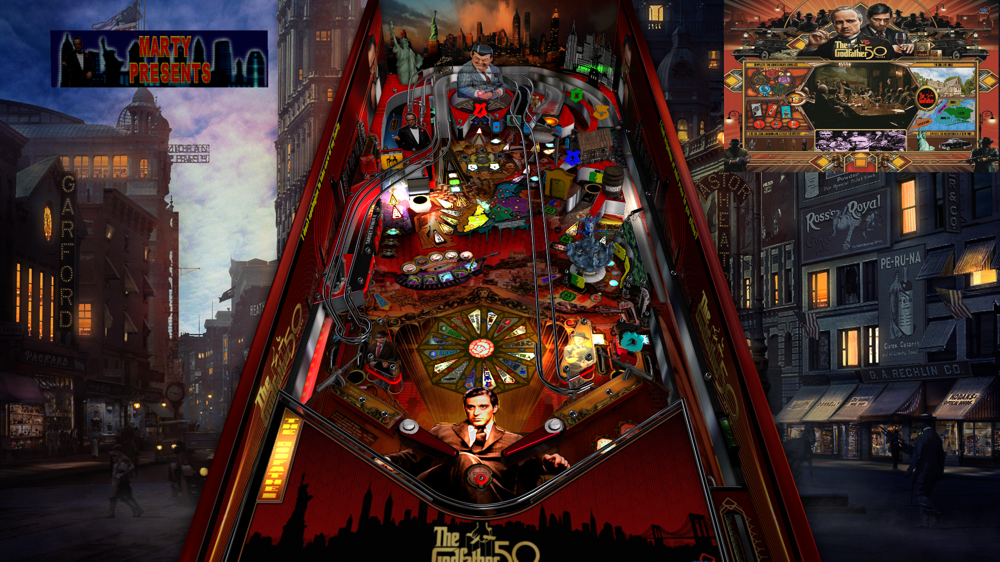

# The Godfather (Original 2024)
Tested By: kaoticBPR    

Authors: [marty02](https://vpuniverse.com/profile/16531-marty02/)
Version: 2.1
Download: [VPUniverse](https://vpuniverse.com/files/file/19352-godfather/)
* discard and don't use the video files, nor the pup triggers. they won't work with this table

DirectB2S

Authors: [marty02](https://vpuniverse.com/profile/16531-marty02/)
Version: 2.1
Download: Included in table download

ROM no Rom necessary

## Status 

Minimum VPX Standalone build: 10.8.0-1989-a764013
| Playfield | Controls | Backglass | DMD | ROM Required | FPS | 
|-----------|----------|-----------|-----|--------------|-----|
| :white_check_mark: | :white_check_mark: | :white_check_mark: | :white_check_mark: | :x: | 60 |

## Instructions

- Copy the contents of this repo folder to your USB drive
- Add your personalized launcher.elf and rename it to vpx-godfather.elf
- Download the table and directb2s versions listed above and copy them into this folder
- Make sure the vpx, direct2b, and ini files are all named the "exact" same
- ignore and don't use the video or puppacks in the download. Discard them, they will tank FPS, and will be choppy during gameplay
- "Join the Family"

