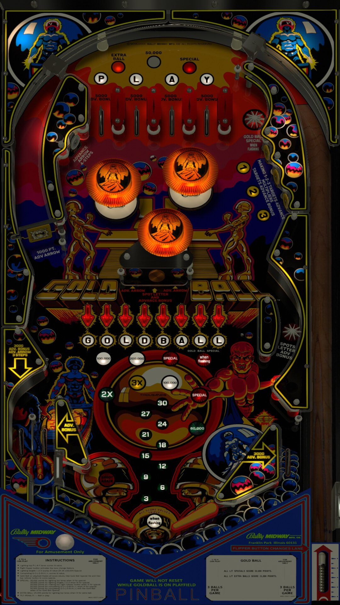

# Gold Ball (Bally 1983) 

Authors: [Goldchicco](https://vpuniverse.com/profile/23579-goldchicco/)  
Version: 1.1  
Download: [VPUniverse](https://vpuniverse.com/files/file/7611-gold-ball-mania-bally-1983-by-goldchicco-team/)

DirectB2S

Authors: [Wildman](https://vpuniverse.com/profile/5-wildman/)  
Download: [VPUniverse](https://vpuniverse.com/files/file/7291-gold-ball-bally-1983/)

ROM

ROM Name: goldbalc.zip  
Download: [VPForums](https://www.vpforums.org/index.php?app=downloads&showfile=645)

SHA1: DD415C92BEA5582A7FF9E2D206EA42BEDA3EFC67  
MD5:  0C23FFCDCB6822F68192147EA3FAD67E 

Tested by: evilwraith

## Status 

Minimum VPX Standalone build: 10.8.0-1989-a764013

| Playfield | Controls | Backglass | DMD | ROM Required | FPS | 
|-----------|----------|-----------|-----|--------------|-----|
| :white_check_mark: | :white_check_mark: | :white_check_mark: | :white_check_mark: | :white_check_mark: | 44 |

## Instructions

- Install this table through the Table Manager, using the `Add Table` > `Manual` page
- If you need help, more information found on the wiki: [TM - Add Table - Manual](https://github.com/LegendsUnchained/vpx-standalone-alp4k/wiki/%5B04%5D-%F0%9F%A7%A1-TM-%E2%80%90-Other-Features#add-table---manual)
- If the table requires any additional files/steps, click `GO TO TABLE` after adding, and the TM will open to the relevant table folder.

