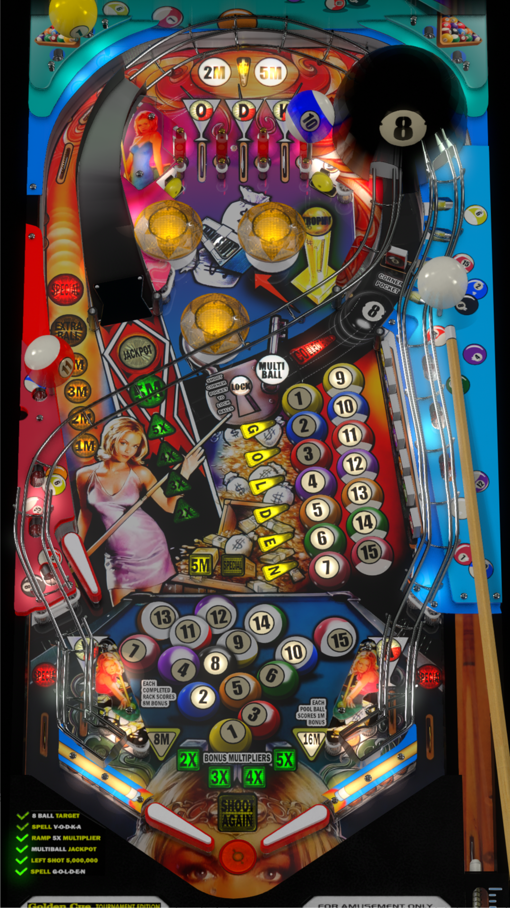

# Golden Cue (Sega 1998)

Tested by: kaoticBPR

Authors: [felsir](https://vpuniverse.com/profile/37000-felsir/)  
Version: 1.4  
Download: [VPUniverse](https://vpuniverse.com/files/file/11417-golden-cue-sega-1998/)

DirectB2S

Authors: [felsir](https://vpuniverse.com/profile/37000-felsir/)  
Version: 1.0.0  
Download: [VPUniverse](https://vpuniverse.com/files/file/11396-golden-cue-sega-1998/)

ROM

Download: [vpforums](https://www.vpforums.org/index.php?app=downloads&showfile=198)  
ROM Name and version: goldcue

## Status 

Minimum VPX Standalone build: 10.8.0-1989-a764013

| Playfield | Controls | Backglass | DMD | ROM Required | FPS | 
|-----------|----------|-----------|-----|--------------|-----|
| :white_check_mark: | :white_check_mark: | :white_check_mark: | :white_check_mark: | :white_check_mark: | 38 |

## Instructions

- Install this table through the Table Manager, using the `Add Table` > `Manual` page
- If you need help, more information found on the wiki: [TM - Add Table - Manual](https://github.com/LegendsUnchained/vpx-standalone-alp4k/wiki/%5B04%5D-%F0%9F%A7%A1-TM-%E2%80%90-Other-Features#add-table---manual)
- If the table requires any additional files/steps, click `GO TO TABLE` after adding, and the TM will open to the relevant table folder.
- "Learn from the best, Kelly Packard"

