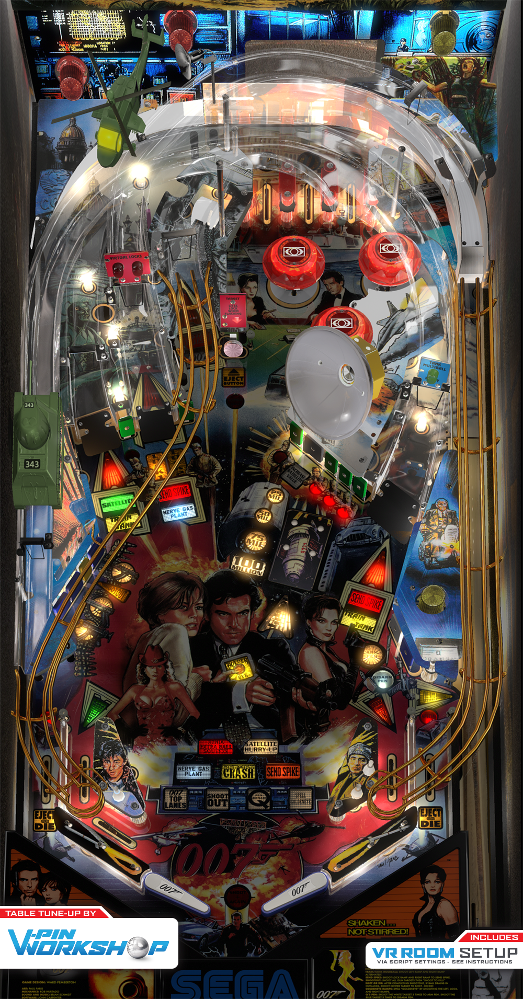

# Goldeneye (Sega 1996)

Authors: [VPinWorkshop](https://vpuniverse.com/profile/40692-vpinworkshop/)  
Version: 1.2 
Download: [VP Universe](https://vpuniverse.com/files/file/10040-goldeneye-sega-1996-vpw-mod/)

DirectB2S

Authors: [hauntfreaks](https://vpuniverse.com/profile/5216-hauntfreaks/)  
Version: 1.0  
Download: [VP Universe](https://vpuniverse.com/files/file/12928-goldeneye-sega-1996-b2s-with-full-dmd/)

ROM

Download: [VP Universe](https://vpuniverse.com/files/file/619-gldneyezip/)

Colored ROM

Download: [VP Universe](https://vpuniverse.com/files/file/22636-goldeneye-serum-colorization/)

## Status 

Minimum VPX Standalone build: 10.8.0-1989-a764013

| Playfield | Controls | Backglass | DMD | ROM Required | FPS | 
|-----------|----------|-----------|-----|--------------|-----|
| :white_check_mark: | :white_check_mark: | :white_check_mark: | :white_check_mark: | :white_check_mark: | 35 |

## Instructions

- Copy the contents of this repo folder to your USB drive
- Add your personalized launcher.elf and rename it to vpx-goldeneye.elf
- Download the table and directb2s versions listed above, extract them (if necessary) and copy them to external/vpx-goldeneye
- Make sure (.vpx), (.directb2s), (.ini) and (.vbs) files are all named the same
- Place ROM zip file into vpx-goldeneye/pinmame/roms folder. DO NOT UNZIP!

