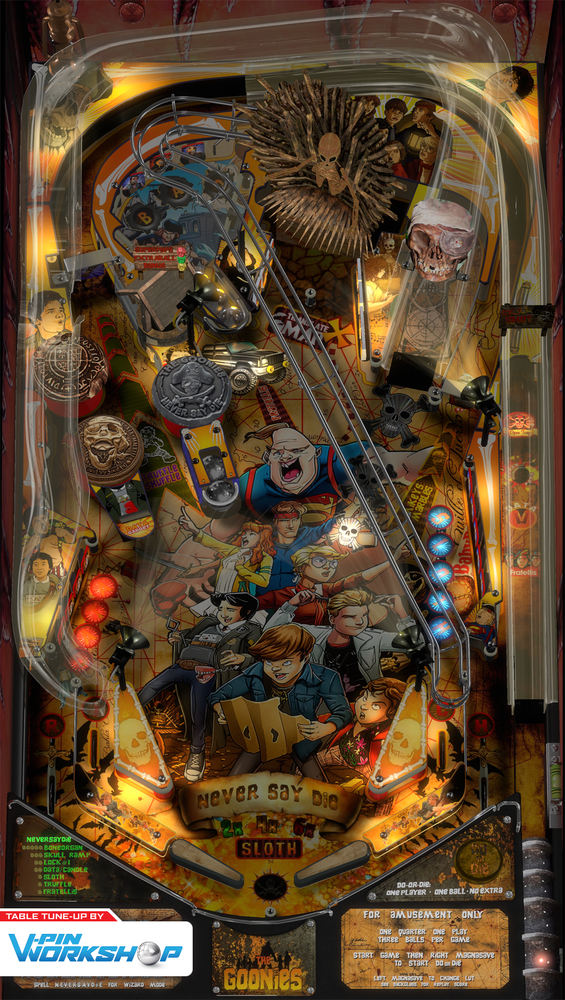

# The Goonies Never Say Die (Original 2021)

Authors: [vpinworkshop](https://vpuniverse.com/profile/40692-vpinworkshop/)  
Download: [VP Universe](https://vpuniverse.com/files/file/7819-the-goonies-never-say-die-pinball-vpw/)

DirectB2S : Included in table download

## Status 

Minimum VPX Standalone build: 10.8.0-1989-a764013

| Playfield | Controls | Backglass | DMD | ROM Required | FPS | 
|-----------|----------|-----------|-----|--------------|-----|
| :white_check_mark: | :white_check_mark: | :white_check_mark: | :white_check_mark: | :x: | 32 |

## Instructions

- Make sure to use the Table Manager to install this table.
- Instructions can be found on the wiki [Add Table - Manual](https://github.com/LegendsUnchained/vpx-standalone-alp4k/wiki/%5B04%5D-%F0%9F%A7%A1-TM-%E2%80%90-Other-Features#add-table---manual)
- If the table requires any additional files/steps, click `GO TO TABLE` after adding, and the TM will open to the relevant table folder.
- Place "thegooniesDMD" folder into the vpx-goonies folder (included in table download) -- Table will crash without it.
- "Baby Ruth!"

