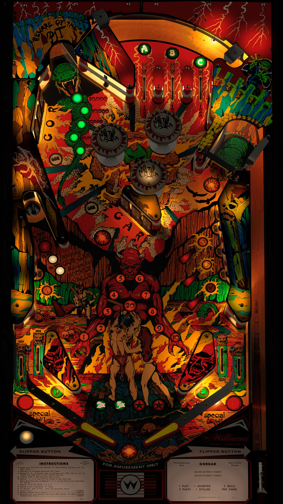

# Gorgar (Williams 1979)

Authors: [Gedankekojote97](https://vpuniverse.com/profile/42203-gedankekojote97/)
Version: 1.1
Download: [VP Universe](https://vpuniverse.com/files/file/9766-gorgar-mod-nfozzy-fleep-sounds-lut/)

DirectB2S

Authors: [HiRze00](https://vpuniverse.com/profile/19941-hirez00/)
Version: 1.0
Download: [VP Universe](https://vpuniverse.com/files/file/9787-gorgar-williams-1979-authentic-b2s/)

ROM

Download: [VP Forums](https://www.vpforums.org/index.php?app=downloads&showfile=783)

Colored ROM

Download: [VP Universe](https://vpuniverse.com/files/file/22901-williams-system-46-serum-pack/)

## Status
Minimum VPX Standalone build: 10.8.0-1989-a764013
| Playfield | Controls | Backglass | DMD | ROM Required | FPS | 
|-----------|----------|-----------|-----|--------------|-----|
| :white_check_mark: | :white_check_mark: | :white_check_mark: | :white_check_mark: | :white_check_mark: | 45 |

## Instructions

- Copy the contents of this repo folder to your USB drive
- Add your personalized launcher.elf and rename it to vpx-gorgar.elf
- Download the table and directb2s versions listed above and copy them into this folder
- Make sure the vpx, directb2s, vbs, and ini files are all named the "exact" same
- "Gorgar SPEAKS!"

