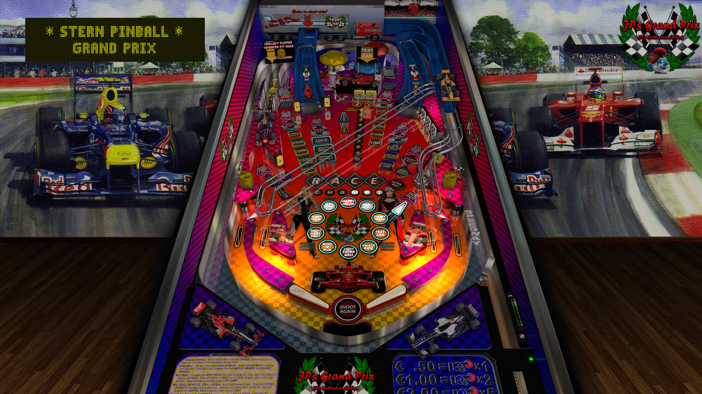

# JP's Grand Prix

Authors: [jpsalas](https://www.vpforums.org/index.php?s=543a5ca562cc33a89debe8ace8834f1e&showuser=277)  
Version: 5.5.0
Download: [VP Forums](https://www.vpforums.org/index.php?app=downloads&showfile=11606)

DirectB2S

Authors: [chucky87](https://vpuniverse.com/profile/10099-chucky87/)  
Version: 1.0  
Download: [VP Universe](https://vpuniverse.com/files/file/4740-grand-prix-stern-2005-2-3-scr-with-animation/)

ROM

Download: [VP Forums](https://www.vpforums.org/index.php?app=downloads&showfile=156)

## Status 

Minimum VPX Standalone build: 10.8.0-1989-a764013
| Playfield | Controls | Backglass | DMD | ROM Required | FPS | 
|-----------|----------|-----------|-----|--------------|-----|
| :white_check_mark: | :white_check_mark: | :white_check_mark: | :white_check_mark: | :white_check_mark: | 60 |

## Instructions

- Install this table through the Table Manager, using the `Add Table` > `Manual` page
- If you need help, more infomation found on the wiki: [TM - Add Table - Manual](https://github.com/LegendsUnchained/vpx-standalone-alp4k/wiki/%5B04%5D-%F0%9F%A7%A1-TM-%E2%80%90-Other-Features#add-table---manual)
- If the table requires any additional files/steps, click `GO TO TABLE` after adding, and the TM will open to the relevant table folder.

