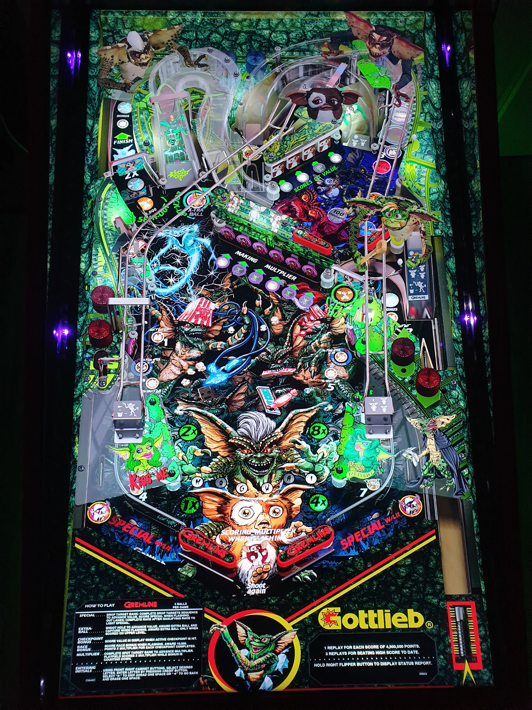

# Gremlins (Original 2022)

Authors: [balutito](https://vpuniverse.com/profile/36070-balutito/)  
Download File: Gremlins by Balutito 1.7.rar  
Filename: Gremlins by Balutito 1.7.vpx  
Download: [VP Universe](https://vpuniverse.com/files/file/10546-gremlins-by-balutito)

DirectB2S Included in Table Download  
Filename: Gremlins by Balutito 1.7.directb2s

Music Located in Table Zip  
File/Folder-Name: gremlins.mp3

Rom included with Table Download  
File/Folder-Name: victory.zip

Tested by: TechZombie

## Status 

Minimum VPX Standalone build: 10.8.0-1989-a764013

| Playfield | Controls | Backglass | DMD | ROM Required | FPS | 
|-----------|----------|-----------|-----|--------------|-----|
| :white_check_mark: | :white_check_mark: | :white_check_mark: | :white_check_mark: | :white_check_mark: | 45 |

## Instructions

- Copy the contents of this repo folder to your USB drive
- Add your personalized launcher.elf and rename it to vpx-gremlins.elf
- Download the table file listed above, extract (if necessary) and copy them to external/vpx-gremlins
- Rom file (victory.zip) stays in zip folder, place zip file in vpx-gremlins/pinmame/roms
- Copy (gremlins.mp3) file to vpx-gremlins/music
- Make sure (.vpx), (.directb2s), (.ini), and (.vbs) files are all named the same
- WARNING: 1. Do not play in direct sunlight 2. Do not drink water while playing 3. And above all never play after midnight!

