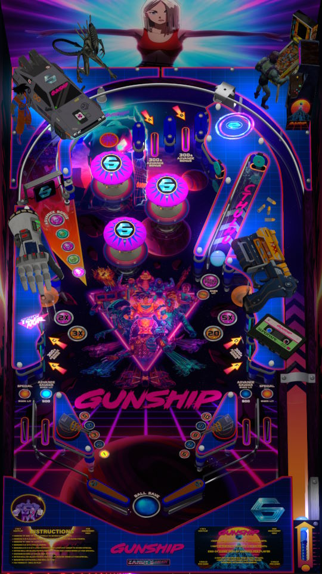

# Gunship pinball music table (Original 2023)

---

## Files
| File Type | Link | Version | Author | 
|-----------|--------|----------|--------------|
| **VPX** | [VP Universe](https://vpuniverse.com/files/file/15778-gunship-pinball-music-table-with-pup-pack/) | 1.1.0 | [ZandysArcade](https://vpuniverse.com/profile/57949-zandysarcade/) |
| **B2S** | N/A | N/A | N/A |
| **DMD** | N/A | N/A | N/A |
| **ROM** | N/A | N/A | N/A |

**Tested by:** [mrandromeda]

---

## Status 
**Minimum VPX Standalone build:** 10.8.0-5b941e6
| Playfield | Controls | Backglass | DMD | ROM Required | FPS | 
|-----------|----------|-----------|-----|--------------|-----|
| :white_check_mark: | :white_check_mark: | :white_check_mark: | :white_check_mark: | :white_check_mark: | 50 |

---

 

<table>
  <tr>
    <td style="background-color: #FFDDDD; padding: 0; border-left: 4px solid #FF0000;">
      

        <strong>⚠️ WARNING ⚠️</strong>
      

      

        Manually added puppacks are not supported by the VPXS 4KP team 
		We will not be able to help you diagnose issues until this puppack is in the Wizard 
		You can however find a guide here on the wiki to help you install it yourself: <a href="https://github.com/LegendsUnchained/vpx-standalone-alp4k/wiki/%5B08%5D-%E2%9D%A4%EF%B8%8F-Pup-Pack-%E2%80%90-Manual-Install">❤️ Pup Pack ‐ Manual Install</a>
      

    </td>
  </tr>
</table>

## Instructions
- Download `MEDIA-pack.zip`
- Extract from the `MEDIA-pack.zip` the rom file `lostwrld.zip` and place the zip file in `vpx-gunship/pinmame/roms`
- Create the folder `pupvideos` and extract from `Gunshippuppack.zip` the `Gunship` folder into `pupvideos`.
- Unzip the `use_these_pup_files.zip` and place them inside the `pupvideos/Gunship` folder, and overwrite files if prompted.
- "Taste Like Venom" - GUNSHIP
