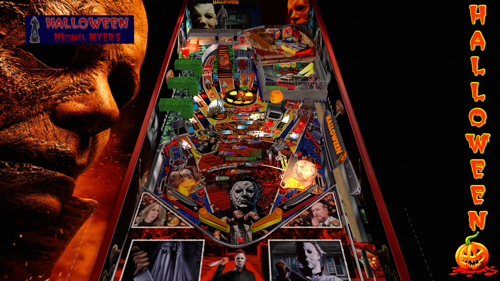

# Halloween MM Edition (Original 2023) Version 3.1

Table

Author: [marty02](https://vpuniverse.com/profile/16531-marty02/)  
Filename:  Pack halloween.zip  
VPX Version: (Version 3.1) halloween_MM_Edition  
Download: [VPUniverse](https://vpuniverse.com/files/file/16526-halloween-mm-edition/)

Backglass is included in Table Zip (Pack halloween.zip)

directb2s Version: (Version 1.0.0) Halloween mike myers(2screen).directb2s 

**No ROM needed for this table**

Tested by:  
[TechZombie]

## Status 

Minimum VPX Standalone build: 10.8.0-1983-b84441e

| Playfield | Controls | Backglass | DMD | ROM Required | FPS | 
|-----------|----------|-----------|-----|--------------|-----|
| :white_check_mark: | :white_check_mark: | :white_check_mark: | :white_check_mark: | :x: | 60 |

## Instructions

- Copy the contents of this repo folder to your USB drive
- Add your personalized launcher.elf and rename it to vpx-halloweenmm.elf
- Download the table and directb2s zips above, extract (if necessary) and copy into /external/vpx-halloweenmm
- Make sure (.vpx), (.directb2s), and (.ini) files are all named the same
- "I realized that what was living behind that boy's eyes was purely and simply... evil." - Dr. Loomis

