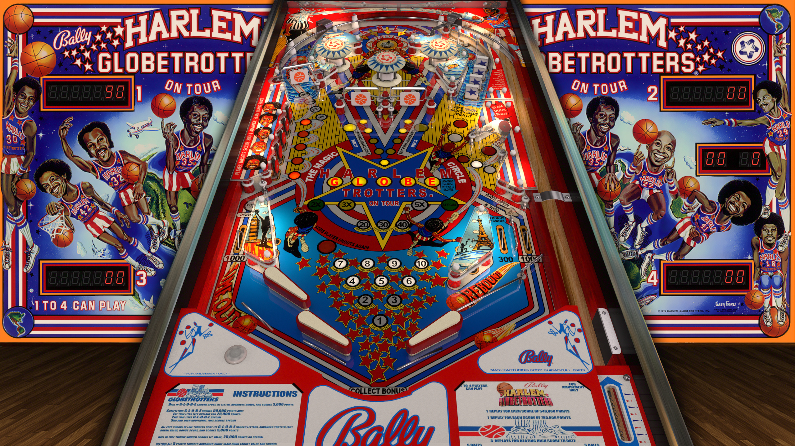

# JP's Harlem Globetrotters On Tour (Bally 1978)

**VPX Table**  
Authors: [jpsalas](https://www.vpforums.org/index.php?showuser=277)  
Version: 5.5.0  
Download: [VP Forums](https://www.vpforums.org/index.php?app=downloads&showfile=12003)

**DirectB2S** 
Authors: [hauntfreaks](https://vpuniverse.com/profile/5216-hauntfreaks/)  
Version: 1.0  
Download: [VP Universe](https://vpuniverse.com/files/file/13443-harlem-globetrotters-on-tour-bally-1978-b2s/)

**ROM** 
This table uses two roms: 
Download hglbtrtb.zip: [VP Forums](https://www.vpforums.org/index.php?app=downloads&showfile=695) 
SHA1: 527A688E11398CCD49ED0A1B9A404EC013A308D6 
MD5: A56BAC62DC6DDB828EBF65EE43CF885F

Download hglbtrtr.zip: [VP Forums](https://www.vpforums.org/index.php?app=downloads&showfile=696) 
SHA1: 446365CD2800D2312861132AF6E028FCF1623C3A 
MD5: A0B8F1530FF690649322D63E631610BA 

Tested by: bhhob

## Status 

Minimum VPX Standalone build: 10.8.0-1989-a764013

| Playfield | Controls | Backglass | DMD | ROM Required | FPS | 
|-----------|----------|-----------|-----|--------------|-----|
| :white_check_mark: | :white_check_mark: | :white_check_mark: | :x: | :white_check_mark: | 60 |

## Instructions

- Install this table through the Table Manager, using the `Add Table` > `Manual` page
- If you need help, more information found on the wiki: [TM - Add Table - Manual](https://github.com/LegendsUnchained/vpx-standalone-alp4k/wiki/%5B04%5D-%F0%9F%A7%A1-TM-%E2%80%90-Other-Features#add-table---manual)
- If the table requires any additional files/steps, click `GO TO TABLE` after adding, and the TM will open to the relevant table folder.
- "Who's that mister? Ain't your sister. It's Sweet Georgia Brown!" 🏀

