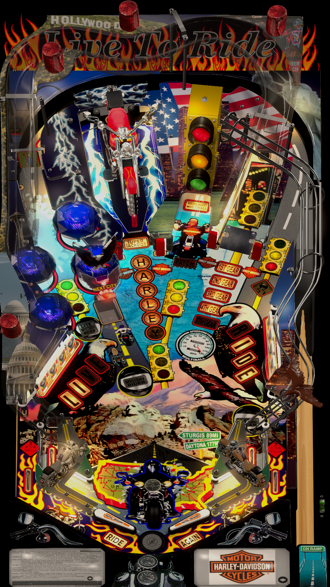

# Harley Davidson (Sega 1999)
Tested By: kaoticBPR

Authors: [nestorgian](https://vpuniverse.com/profile/27437-nestorgian/)
Version: 1.12
Download: [VPUniverse](https://vpuniverse.com/files/file/10908-harley-davidson-sega-1999/?tab=details)

DirectB2S

Authors: [hauntfreaks](https://vpuniverse.com/profile/5216-hauntfreaks/)
Version: 1.0.0
Download: [VPUniverse](https://vpuniverse.com/files/file/15283-harley-davidson-sega-1999-b2s-with-full-dmd/)

ROM

Download: [vpforums](https://www.vpforums.org/index.php?app=downloads&showfile=1089)
ROM Name and version: harl_a30

## Status 

Minimum VPX Standalone build: 10.8.0-1989-a764013
| Playfield | Controls | Backglass | DMD | ROM Required | FPS | 
|-----------|----------|-----------|-----|--------------|-----|
| :white_check_mark: | :white_check_mark: | :white_check_mark: | :white_check_mark: | :white_check_mark: | 40 |

## Instructions

- Copy the contents of this repo folder to your USB drive
- Add your personalized launcher.elf and rename it to vpx-harleyd.elf
- Download the table and directb2s versions listed above and copy them into this folder
- Make sure the vpx, direct2b, and ini files are all named the "exact" same
- Place harl_a30.zip in the external/vpx-harleyd/pinmame/roms folder *Do Not unzip*
- "Born to be Wild"

