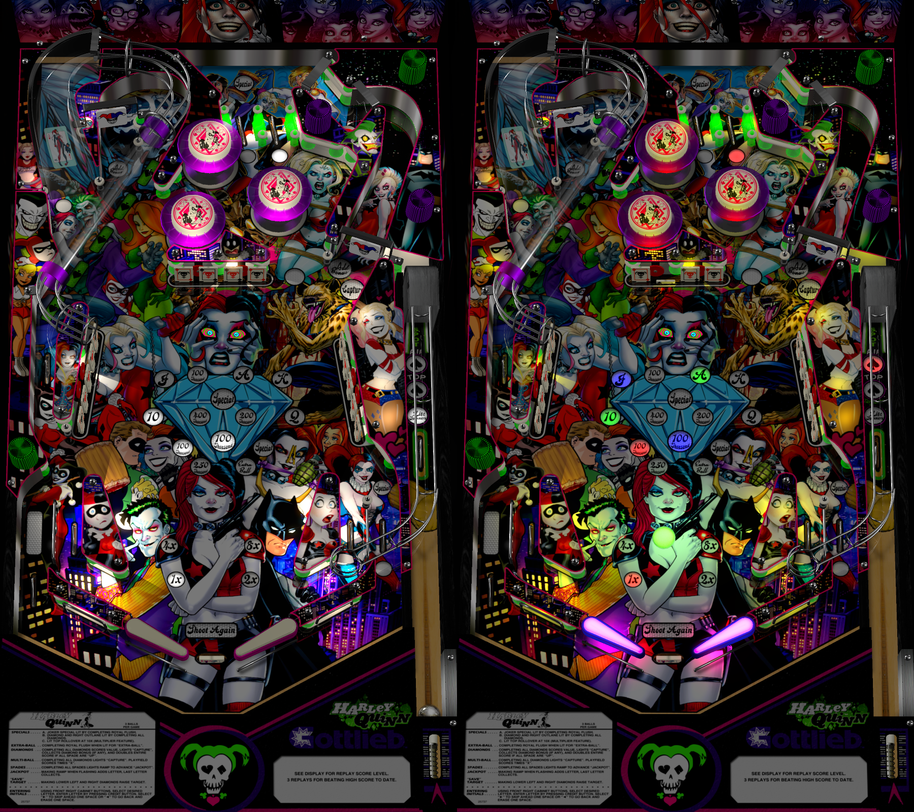

# Harley Quinn (Original 2017)

---

## Files
| File Type | Link | Version | Author | 
|-----------|--------|----------|--------------|
| **VPX** | [vpuniverse](https://vpuniverse.com/files/file/6285-harley-quinn-hauntfreaks-2017-in-ultra-mega-real-4k/) | 1.0.0 | [hauntfreaks](https://vpuniverse.com/profile/5216-hauntfreaks/) |
| **B2S** | [vpuniverse](https://vpuniverse.com/files/file/11830-harley-quinn-hauntfreaks-2017-b2s-with-full-dmd/) | 1.1 | [hauntfreaks](https://vpuniverse.com/profile/5216-hauntfreaks/)
| **ROM** | Included with table | Unknown | Unknown |

**Tested by:** [B-Woo]

---

## Status 
Minimum VPX Standalone build: 10.8.0-1989-a764013

| Playfield | Controls | Backglass | DMD | ROM Required | FPS | 
|-----------|----------|-----------|-----|--------------|-----|
| :white_check_mark: | :white_check_mark: | :white_check_mark: | :white_check_mark: | :white_check_mark: | 50 |

---

## Instructions

- Make sure to use the Table Manager to install this table.
- Instructions can be found on the wiki [Add Table - Manual](https://github.com/LegendsUnchained/vpx-standalone-alp4k/wiki/%5B04%5D-%F0%9F%A7%A1-TM-%E2%80%90-Other-Features#add-table---manual)
- If the table requires any additional files/steps, click `GO TO TABLE` after adding, and the TM will open to the relevant table folder.

