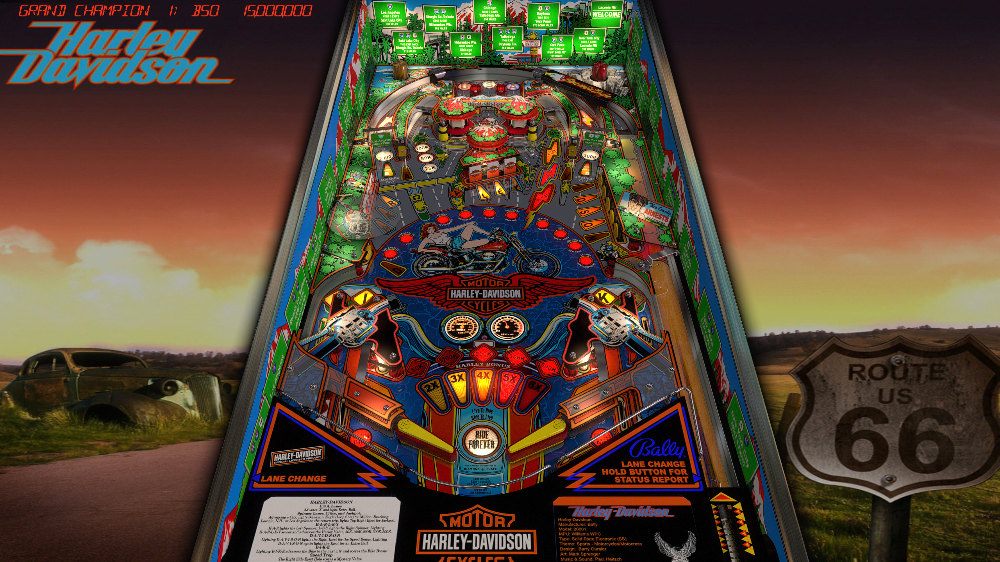

# Harley Davidson (Bally 1991)
Tested By: kaoticBPR

Authors: [JPSalas](https://www.vpforums.org/index.php?showuser=277)
Version: 4.3.0
Download: [VPForums](https://www.vpforums.org/index.php?app=downloads&showfile=13632)

DirectB2S

Authors: [hauntfreaks](https://vpuniverse.com/profile/5216-hauntfreaks/)
Version: 1.0.0
Download: [VPUniverse](https://vpuniverse.com/files/file/11200-harley-davidson-bally-1991-b2s-with-full-dmd/)

ROM

Download: [vpforums](https://www.vpforums.org/index.php?app=downloads&showfile=1082hd_l3)
ROM Name and version: hd_l3

## Status 

Minimum VPX Standalone build: 10.8.0-1989-a764013
| Playfield | Controls | Backglass | DMD | ROM Required | FPS | 
|-----------|----------|-----------|-----|--------------|-----|
| :white_check_mark: | :white_check_mark: | :white_check_mark: | :white_check_mark: | :white_check_mark: | 50 |

## Instructions

- Make sure to use the Table Manager to install this table.
- Instructions can be found on the wiki [Add Table - Manual](https://github.com/LegendsUnchained/vpx-standalone-alp4k/wiki/%5B04%5D-%F0%9F%A7%A1-TM-%E2%80%90-Other-Features#add-table---manual)
- If the table requires any additional files/steps, click `GO TO TABLE` after adding, and the TM will open to the relevant table folder.
- "Born to be wild!"

