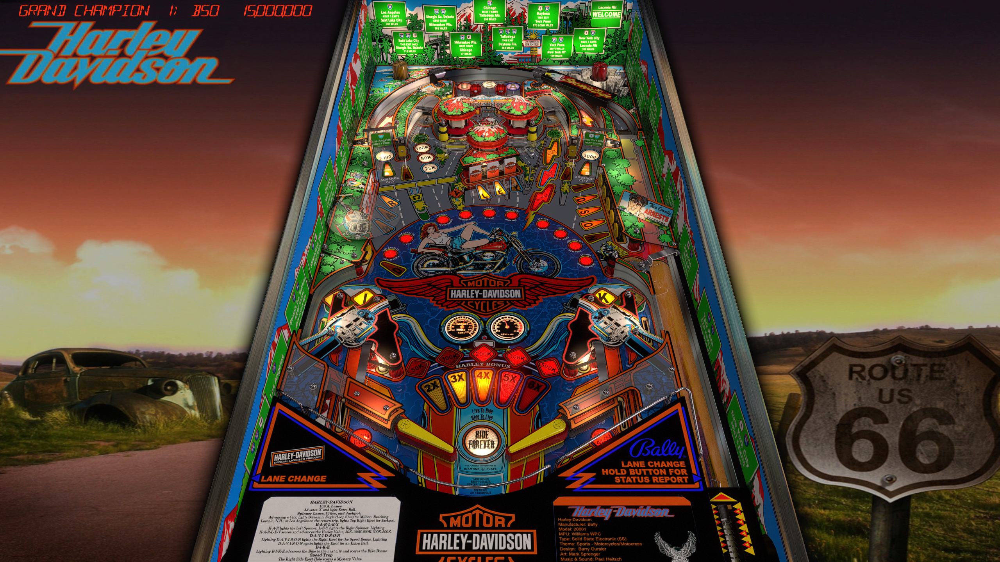

# Harley-Davidson (Bally 1991)

---

## Files
| File Type | Link | Version | Author(s) | 
|-----------|--------|----------|--------------|
| **VPX** | [vpforums](https://www.vpforums.org/index.php?app=downloads&showfile=13632) | 6.0.1 | JPSalas, Siggi, Draifet |
| **B2S** | [vpuniverse](https://vpuniverse.com/files/file/11200-harley-davidson-bally-1991-b2s-with-full-dmd/) | 1.0 |  |
| **ROM** | [vpforums](https://www.vpforums.org/index.php?app=downloads&showfile=1082) | hd_l3 | Destruk |
| **SERUM** | [N/A](#) | N/A | N/A |
| **PUPPACK** | [N/A](#) | N/A | N/A |

**Tested by:** kaoticBPR

---

## Status 

| Backglass | DMD | ROM Required | Has Puppack | FPS |
|-----------|-----|-----|-----|-----|
| ✅ | ✅ | ✅ | ❌ | 60 |

---

## Instructions

- Install this table through the Table Manager, using the `Add Table` > `Manual` page
- If you need help, more infomation found on the wiki: [TM - Add Table - Manual](https://github.com/LegendsUnchained/vpx-standalone-alp4k/wiki/%5B04%5D-%F0%9F%A7%A1-TM-%E2%80%90-Other-Features#add-table---manual)
- If the table requires any additional files/steps, click `GO TO TABLE` after adding, and the TM will open to the relevant table folder.
- 'Born to be wild!'
