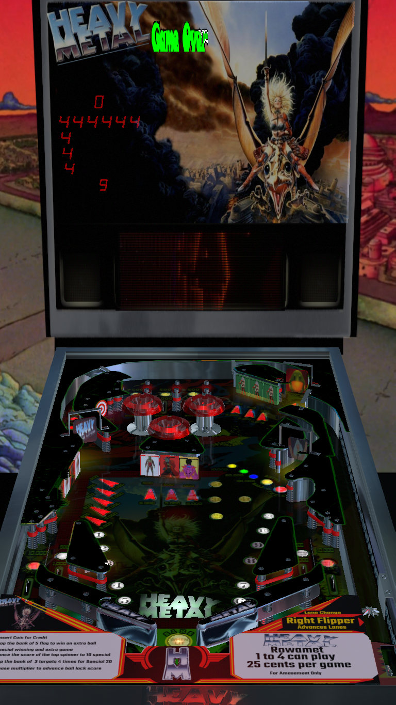

# Heavy Metal [Classic] (Rowamet 1983)

---

## Files
| File Type | Link | Version | Author | 
|-----------|--------|----------|--------------|
| **VPX** | [VPForums](https://www.vpforums.org/index.php?app=downloads&showfile=15165) | 4.0 | [weisshund](https://www.vpforums.org/index.php?s=33b6da5b0d30dd67744393476a653fb4&showuser=150364) |
| **B2S** | included with table | 4.0 | [weisshund](https://www.vpforums.org/index.php?s=33b6da5b0d30dd67744393476a653fb4&showuser=150364) |
| **DMD** | N/A | N/A | N/A |
| **ROM** | [VPForums](https://www.vpforums.org/index.php?app=downloads&showfile=455) | ? | [Rowamet](https://www.arcade-museum.com/company/rowamet-ind-a-eletrometal-a-ltda) |

**Tested by:** [Curt](https://github.com/Old-Cyrus)

---

## Status 
**Minimum VPX Standalone build:** 10.8.0-1989-a764013

| Playfield | Controls | Backglass | DMD | ROM Required | FPS | 
|-----------|----------|-----------|-----|--------------|-----|
| :white_check_mark: | :white_check_mark: | :white_check_mark: | :x: | :white_check_mark: | 60 |

---

## Instructions

- Install this table through the Table Manager, using the `Add Table` > `Manual` page
- If you need help, more infomation found on the wiki: [TM - Add Table - Manual](https://github.com/LegendsUnchained/vpx-standalone-alp4k/wiki/%5B04%5D-%F0%9F%A7%A1-TM-%E2%80%90-Other-Features#add-table---manual)
- If the table requires any additional files/steps, click `GO TO TABLE` after adding, and the TM will open to the relevant table folder.

