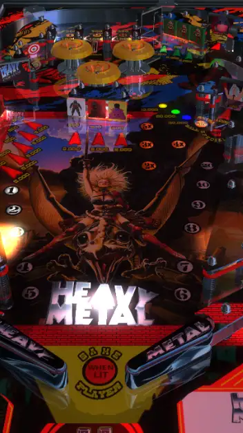

# Heavy Metal Fantasy Table (Mod) (Rowamet 1983)

---

## Files
| File Type | Link | Version | Author(s) | 
|-----------|--------|----------|--------------|
| **VPX** | [vpforums](https://www.vpforums.org/index.php?app=downloads&showfile=15165) | 4.0 | Wiesshund, Destruk, Cujopb |
| **B2S** | [vpuniverse](https://vpuniverse.com/files/file/9761-heavy-metal-rowamet-1983/) | 1.1.1 | Larouillas |
| **ROM** | [vpforums](https://www.vpforums.org/index.php?app=downloads&showfile=455) | heavymtl | Destruk |
| **DMD** | [vpforums](https://www.vpforums.org/index.php?app=downloads&showfile=15165) | N/A | Weisshund |

**Tested by:** Curt

---

## Status 

| Backglass | DMD | ROM Required | Has Puppack | FPS |
|-----------|-----|-----|-----|-----|
| ✅ | ✅ | ✅ | ❌ | 60 |

---

## Instructions

- Install this table through the Table Manager, using the `Add Table` > `Manual` page. To distinguish this table from the Classic version, I named mine vpx-heavymetalfantasy
- If you need help, more information can be found on the wiki: [TM - Add Table - Manual](https://github.com/LegendsUnchained/vpx-standalone-alp4k/wiki/%5B04%5D-%F0%9F%A7%A1-TM-%E2%80%90-Other-Features#add-table---manual)
- To finish the table installation, click `GO TO TABLE` after adding, and the TM will open to the table folder. Then, perform the following steps before playing:

1. Download the soundtrack music from one of the links provided in the .vpx download page or the `READ ME NOW or suffer.txt` file in the download. (Please note that all of the other steps in that README have already been performed for you, and have been included in your `table.vbs' download)
2. Change the name of the soundtrack folder from `Music` to `HeavyMetal`
3. create a folder titled `music` in your `vpx-heavymetalfantasy` folder
4. Using Table Manager, upload the `HeavyMetal` folder on your computer into the `music` folder in your vpxs drive
-----
5. Unzip the `HEAVY METAL DMD.zip' file that you got from the DMD link above
6. Using Table Manager, upload the `HvyMtl.DMD` folder on your computer into the `vpx-heavymetalfantasy` folder in your vpxs drive
-----

-----
7. In the pinmame folder, create a blank text file, alias.txt.
8. Edit alias.txt, and add this as the only line: HeavyMetal,heavymtl

- "From one war to another, my influence is always present."
