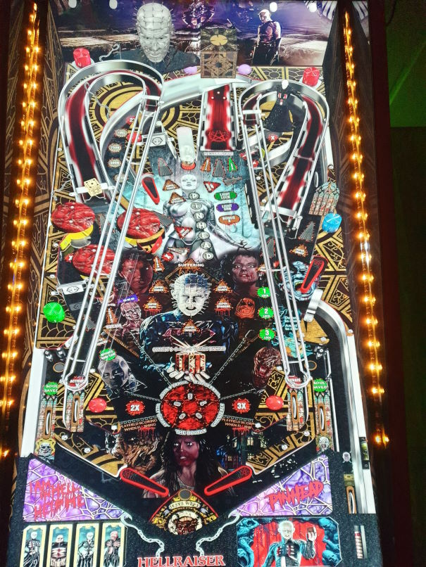

# Hellraiser (Original 2022)

---

## Files
| File Type | Link | Version | Author | 
|-----------|--------|----------|--------------|
| **VPX** | [VP Universe](https://vpuniverse.com/files/file/11755-hellraiser/) | 1.2 | [balutito](https://vpuniverse.com/profile/36070-balutito/) |
| **B2S** | N/A | N/A |
| **DMD** | N/A | N/A |
| **ROM** | N/A | N/A |
| **PUP** | [VP Universe](https://vpuniverse.com/files/file/11763-hellraiser/) | 1.0.1 | [TeamTuga](https://vpuniverse.com/profile/31843-teamtuga/) |

**Tested by:** [mrandromeda]

---

## Status 
**Minimum VPX Standalone build:** 10.8.0-5b941e6
| Playfield | Controls | Backglass | DMD | ROM Required | FPS | 
|-----------|----------|-----------|-----|--------------|-----|
| :white_check_mark: | :white_check_mark: | :white_check_mark: | :white_check_mark: | :x: | 50 |

---

 

<table>
  <tr>
    <td style="background-color: #FFDDDD; padding: 0; border-left: 4px solid #FF0000;">
      

        <strong>⚠️ WARNING ⚠️</strong>
      

      

        Manually added puppacks are not supported by the VPXS 4KP team 
		We will not be able to help you diagnose issues until this puppack is in the Wizard 
		You can however find a guide here on the wiki to help you install it yourself: <a href="https://github.com/LegendsUnchained/vpx-standalone-alp4k/wiki/%5B08%5D-%E2%9D%A4%EF%B8%8F-Pup-Pack-%E2%80%90-Manual-Install">❤️ Pup Pack ‐ Manual Install</a>
      

    </td>
  </tr>
</table>

## Instructions

- Install this table through the Table Manager, using the `Add Table` > `Manual` page
- If you need help, more information found on the wiki: [TM - Add Table - Manual](https://github.com/LegendsUnchained/vpx-standalone-alp4k/wiki/%5B04%5D-%F0%9F%A7%A1-TM-%E2%80%90-Other-Features#add-table---manual)
- If the table requires any additional files/steps, click `GO TO TABLE` after adding, and the TM will open to the relevant table folder.
- Download the puppack `Hellraiser1.0.1.rar` from the link listed above.
- Create the folder `pupvideos` within the `external/vpx-hellraiser`
- Extract the folder `Hellraiser` from the puppack archive, and put it in the `pupvideos` folder.
- Unzip the `use_these_pup_files.zip` and place them inside the `pupvideos/Hellraiser` folder, and overwrite files if prompted.
- "No tears, please. It's a waste of good suffering." - Pinhead

