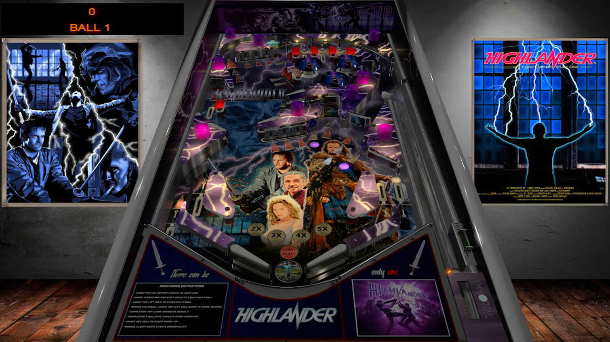

# Highlander (TBA 2019)

Authors: [ivantba](https://www.vpforums.org/index.php?showuser=123858)  
Download File: Highlander (TBA 2019).zip  
Filename: Highlander (TBA 2019).vpx  
Download: [VPForums](https://www.vpforums.org/index.php?app=downloads&showfile=15050)

DirectB2S Included with Table zip  
Filename: Highlander (TBA 2019).directb2s

Rom

Authors: [destruk](https://www.vpforums.org/index.php?showuser=5)  
Filename: stest.zip  
Download: (https://www.vpforums.org/index.php?app=downloads&showfile=575)

Music

Filename: music.zip  
Download: (https://mega.nz/file/eT4wwSTT#aftvXTG20PSOVSsWxH3WWadzav4JJHYaqwZnV9tp2aw)

Tested by: TechZombie

## Status 

Minimum VPX Standalone build: 10.8.0-1989-a764013

| Playfield | Controls | Backglass | DMD | ROM Required | FPS | 
|-----------|----------|-----------|-----|--------------|-----|
| :white_check_mark: | :white_check_mark: | :white_check_mark: | :x: | :white_check_mark: | 60 |

## Instructions

- Install this table through the Table Manager, using the `Add Table` > `Manual` page
- If you need help, more infomation found on the wiki: [TM - Add Table - Manual](https://github.com/LegendsUnchained/vpx-standalone-alp4k/wiki/%5B04%5D-%F0%9F%A7%A1-TM-%E2%80%90-Other-Features#add-table---manual)
- If the table requires any additional files/steps, click `GO TO TABLE` after adding, and the TM will open to the relevant table folder.
- Download and Unzip (music.zip) Copy (music) folder to vpx-highlander
- "There can be only one!" - Connor MacLeod

