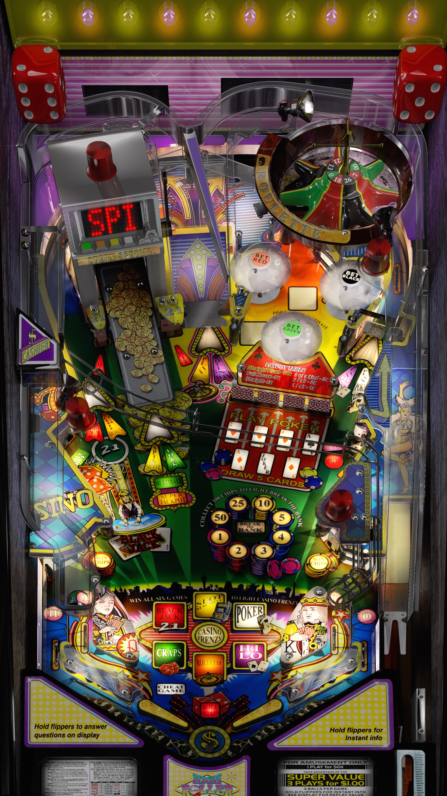

# High Roller Casino (Stern 2001)

Authors: [DJRobX](https://www.vpforums.org/index.php?showuser=25804)  
Version: 1.1  
Download: [VPForums](https://www.vpforums.org/index.php?app=downloads&showfile=14586)

DirectB2S

Authors: [ryguy417](https://vpuniverse.com/profile/31096-ryguy417/)  
Download: [VPUniverse](https://vpuniverse.com/files/file/13143-high-roller-casino-stern-2001-b2s-with-full-dmd/)

ROM

ROM Name: hirolcas.zip  
Download: [VPForums](https://www.vpforums.org/index.php?app=downloads&showfile=1109)  

SHA1: FC00A3F8A8EF894C9CBD4482274DC29693B0D377  
MD5:  530059666882FF4219846E21983C6224 

Tested by: Bruno15477 and evilwraith

## Status 

Minimum VPX Standalone build: 10.8.0-1989-a764013

| Playfield | Controls | Backglass | DMD | ROM Required | FPS | 
|-----------|----------|-----------|-----|--------------|-----|
| :white_check_mark: | :white_check_mark: | :white_check_mark: | :white_check_mark: | :white_check_mark: | 40 |

## Instructions

- Make sure to use the Table Manager to install this table.
- Instructions can be found on the wiki [Add Table - Manual](https://github.com/LegendsUnchained/vpx-standalone-alp4k/wiki/%5B04%5D-%F0%9F%A7%A1-TM-%E2%80%90-Other-Features#add-table---manual)
- If the table requires any additional files/steps, click `GO TO TABLE` after adding, and the TM will open to the relevant table folder.

