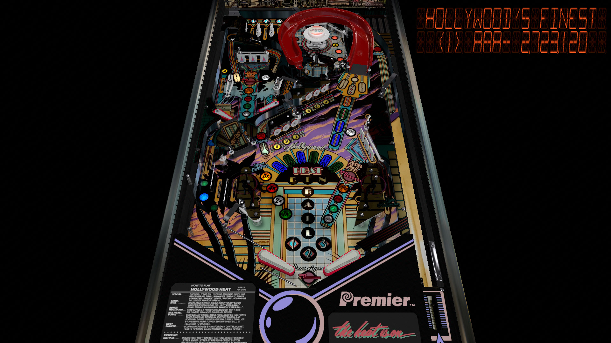

# Hollywood Heat (Gottlieb 1986)

Author(s): [BorgDog](https://vpuniverse.com/profile/5088-borgdog/)  
Version:  2115183029_HollywoodHeat(Gottlieb1986) 1.0  
Download:  [VP Universe](https://vpuniverse.com/files/file/6299-hollywood-heat-gottlieb-1986/)

DirectB2S

Authors: [Walterwhite](https://vpuniverse.com/profile/17464-walterwhite/)  
Version: Hollywood Heat 3 Screen Full DMD 1.0.0  
Download: [VP Universe](https://vpuniverse.com/files/file/11052-hollywood-heat-3-screen-full-dmd/)

ROM: hlywoodh

Authors: [Rock-ola](https://pinballnirvana.com/forums/members/rock-ola.1/)  
Version: hlywoodh.zip  
Download: [Pinball Nirvana](https://pinballnirvana.com/forums/resources/hlywoodh.1942/)

Tested by:  
[CoffeeAtJoes]

## Status 

Minimum VPX Standalone build: 10.8.0-1983-b84441e

| Playfield | Controls | Backglass | DMD | ROM Required | FPS | 
|-----------|----------|-----------|-----|--------------|-----|
| :white_check_mark: | :white_check_mark: | :white_check_mark: | :white_check_mark: | :white_check_mark: | 45 |

## Instructions

- Copy the contents of this repo folder to your USB drive
- Add your personalized launcher.elf and rename it to vpx-hollywoodheat.elf
- Download the table & backglass zips above, extract them and copy them to the external/vpx-hollywoodheat folder
- Place the ROM zip (hlywoodh.zip) in the /vpx-hollywoodheat/pinmame/roms folder. (Do not un-zip!)
- Make sure (.vpx), (.direct2b2s), and (.ini) files are all named the same
- "The Heat is on!"

