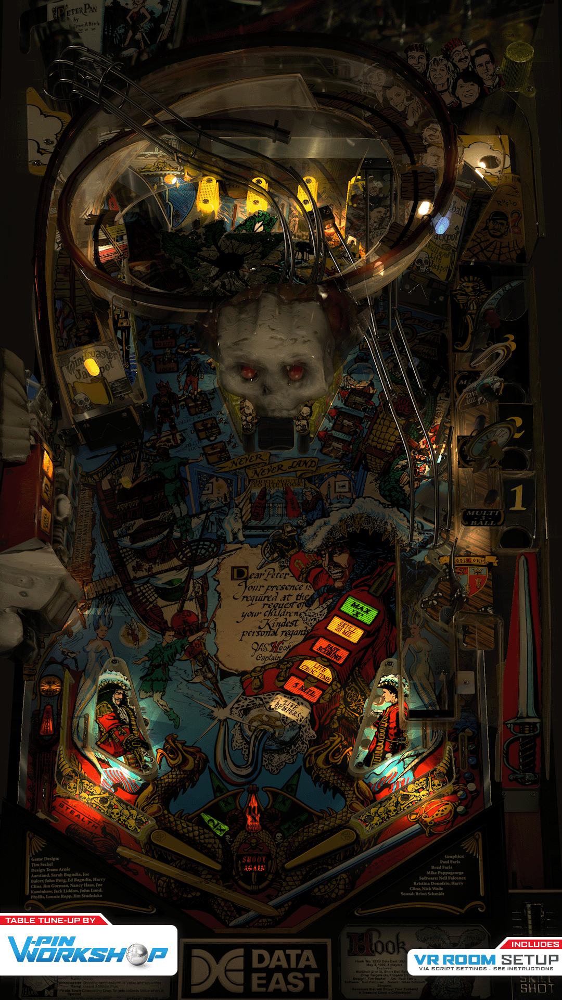

# Hook (Data East 1992)

Authors: [VPinWorkshop](https://www.vpforums.org/index.php?showuser=153279)  
Version: 1.0
Download: [VP Forums](https://www.vpforums.org/index.php?app=downloads&showfile=15555)

DirectB2S

Authors: [Wildman](https://vpuniverse.com/profile/5-wildman/)  
Version: 2.0
Download: [VP Universe](https://vpuniverse.com/files/file/2388-hook-data-east-1992/)

ROM (both required)

Download: [VP Universe](https://vpuniverse.com/files/file/5095-hook-501-unofficial-mod/)
Download: [VP Universe](https://vpuniverse.com/files/file/1781-hook_408zip/)

## Status 

Minimum VPX Standalone build: 10.8.0-1989-a764013
| Playfield | Controls | Backglass | DMD | ROM Required | FPS | 
|-----------|----------|-----------|-----|--------------|-----|
| :white_check_mark: | :white_check_mark: | :white_check_mark: | :white_check_mark: | :white_check_mark: | 35 |

## Instructions

