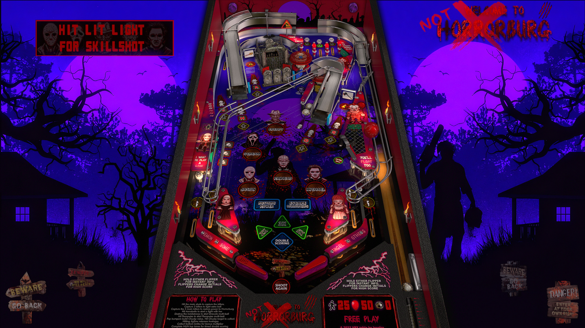

# Horrorburg JP_VPX8

Author(s): [jpsalas](https://www.vpforums.org/index.php?showuser=277)  
Version: Horrorburg JP_VPX8.zip  
Download:  [VP Forums](https://www.vpforums.org/index.php?app=downloads&showfile=17575)

DirectB2S

Version: Horrorburg (Original 2023)_Hauntfreaks_db2s.zip 

Author(s): [hauntfreaks](https://www.vpforums.org/index.php?showuser=73849)  
Download:  [VP Forums](https://www.vpforums.org/index.php?app=downloads&showfile=17602)

ROM:  
No ROM Needed

Tested by:  
[TechZombie]

## Status 

Minimum VPX Standalone build: 10.8.0-1983-b84441e  

| Playfield | Controls | Backglass | DMD | ROM Required | FPS | 
|-----------|----------|-----------|-----|--------------|-----|
| :white_check_mark: | :white_check_mark: | :white_check_mark: | :white_check_mark: | :x: | 57 |

## Instructions

- Install this table through the Table Manager, using the `Add Table` > `Manual` page
- If you need help, more infomation found on the wiki: [TM - Add Table - Manual](https://github.com/LegendsUnchained/vpx-standalone-alp4k/wiki/%5B04%5D-%F0%9F%A7%A1-TM-%E2%80%90-Other-Features#add-table---manual)
- If the table requires any additional files/steps, click `GO TO TABLE` after adding, and the TM will open to the relevant table folder.
- "Do you like Scary Vpin Tables?" --Ghostface

