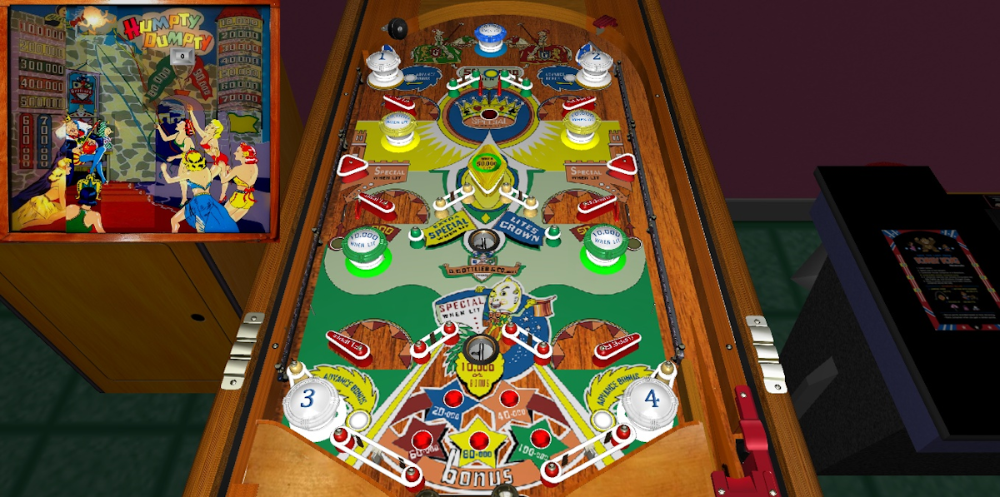

# Humpty Dumpty (Gottlieb 1947)

Authors: [randr](https://vpuniverse.com/profile/1835-randr/)  
Version: 2.1  
Download: [VP Universe](https://vpuniverse.com/files/file/3575-humpty-dumpty-gotlieb-1947/)

DirectB2S

Version: 2.1  
Download: [VP Universe](https://vpuniverse.com/applications/core/interface/file/attachment.php?id=19987&key=9f706176f9fb29fccfe8ba3fda91f9ff)

ROM

None

## Status 

Minimum VPX Standalone build: 10.8.0-1989-a764013

| Playfield | Controls | Backglass | DMD | ROM Required | FPS | 
|-----------|----------|-----------|-----|--------------|-----|
| :white_check_mark: | :white_check_mark: | :white_check_mark: | :x:  | :x:  | 60 |

## Instructions

- Install this table through the Table Manager, using the `Add Table` > `Manual` page
- If you need help, more infomation found on the wiki: [TM - Add Table - Manual](https://github.com/LegendsUnchained/vpx-standalone-alp4k/wiki/%5B04%5D-%F0%9F%A7%A1-TM-%E2%80%90-Other-Features#add-table---manual)
- If the table requires any additional files/steps, click `GO TO TABLE` after adding, and the TM will open to the relevant table folder.

