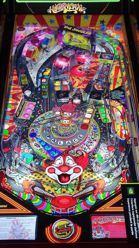

# Hurricane - Balutito Mod 2.0

Author: [Balutito](https://vpuniverse.com/profile/36070-balutito/)  
Version: 2.0  
Download: [VP Universe](https://vpuniverse.com/files/file/9089-hurricane-1991-balutito-mod/)

DirectB2S

Author: [Hauntfreaks](https://vpuniverse.com/profile/5216-hauntfreaks/)  
Version: 2.0.1  
Download: [VP Universe](https://vpuniverse.com/files/file/10985-hurricane-williams-1991-b2s-with-full-dmd/)

ROM

Download: [VP Forums](https://www.vpforums.org/index.php?app=downloads&showfile=1184)

## Status 

Minimum VPX Standalone build: 10.8.0-1983-b84441e

| Playfield | Controls | Backglass | DMD | ROM Required | FPS | 
|-----------|----------|-----------|-----|--------------|-----|
| :white_check_mark: | :white_check_mark: | :white_check_mark: |:white_check_mark: | :white_check_mark: | 40 |

## Instructions

- Copy the contents of this repo folder to your USB drive
- Add your personalized launcher.elf and rename it to vpx-hurricane.elf
- Download the table, ROM and directb2s versions listed above and copy them into this folder
- Make sure (.vpx) and (.directb2s) files are all named the same
- Hurricane is Blowing into Town!

