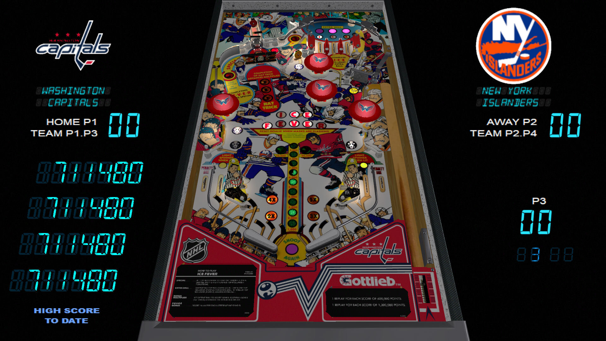

# Ice Fever (Gottlieb 1985)

## Files
| File Type | Link | Version | Author | 
|-----------|--------|----------|--------------|
| **VPX** | [VPUniverse](https://vpuniverse.com/files/file/11868-ice-fever-gottleib-1985/) | 3.0.1 | [endeemillr](https://vpuniverse.com/profile/37895-endeemillr/) |
| **B2S** | Included In VPX | Included In VPX  | Included In VPX |
| **DMD** | Not Needed | Not Needed | Not Needed |
| **ROM** | [PinballNirvana](https://pinballnirvana.com/forums/resources/icefever.3350/) | 9-7-2022 | [rockola](https://pinballnirvana.com/forums/members/rock-ola.1/) |

**Tested by:** [vicpac73]

---

## Status 
**Minimum VPX Standalone build:** {vpx-standalone-build-#}

| Playfield | Controls | Backglass | DMD | ROM Required | FPS | 
|-----------|----------|-----------|-----|--------------|-----|
| :white_check_mark: | :white_check_mark: | :white_check_mark: | :white_check_mark: | :white_check_mark: | 45 |

---

## Instructions

- Install this table through the Table Manager, using the `Add Table` > `Manual` page
- If you need help, more information found on the wiki: [TM - Add Table - Manual](https://github.com/LegendsUnchained/vpx-standalone-alp4k/wiki/%5B04%5D-%F0%9F%A7%A1-TM-%E2%80%90-Other-Features#add-table---manual)
- If the table requires any additional files/steps, click `GO TO TABLE` after adding, and the TM will open to the relevant table folder.
- This VPX has a mod to theme the game with any of the 32 NHL teams
- From the "Ice Fever  (Gottlieb 1985) NHL Mod3.0.zip" file use the "Ice Fever  (Gottlieb 1985) NHL Mod Widescreen 2 screen.directb2s" file as the backglass

## Important Info

- To change the home and away teams use the D-pad/Joystick and the left flipper.  Hold the D-pad to the right and press the left flipper to change the Home team
- Contining to hold the d-pad additional presses of the left flipper until will cycle through the teams until the one you want is displayed.
- Hold the D-pad to the left and press the left flipper to change the Away team.
