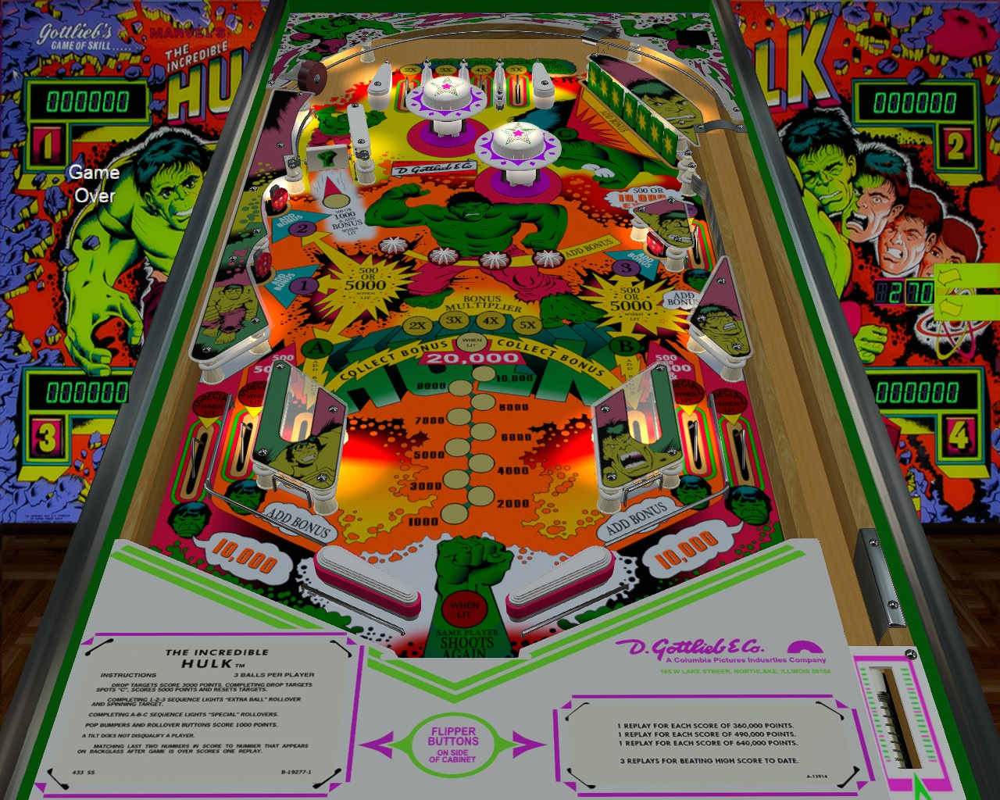

The Incredible Hulk (Gottlieb 1979)

Author: [STYX](https://www.vpforums.org/index.php?s=4f52c8e7de16f297b60b17013bd01932&app=core&module=search&do=user_activity&search_app=downloads&mid=62551)  

Tested by: Dr_Wraith

Version: 1.31

Download: [VP Forums](https://www.vpforums.org/index.php?app=downloads&showfile=18278)

DirectB2S

Author: [Hauntfreaks](https://vpuniverse.com/profile/5216-hauntfreaks/)  

Version: 1.0.0

Download: [VP Universe](https://vpuniverse.com/files/file/15947-the-incredible-hulk-gottlieb-1979-b2s/)

ROM

Download: [Internet Archive](https://archive.org/details/hulk_20240824)

SHA: CAEA94ABD2E627D9F4A57494016549B705300DEB

MD5: FAC1DF81F93B43F5B93A5E11EED079E9

## Status 

Minimum VPX Standalone build: 10.8.0-2026-3b68d7c
| Playfield | Controls | Backglass | DMD | ROM Required | FPS | 
|-----------|----------|-----------|-----|--------------|-----|
| :white_check_mark: | :white_check_mark: | :white_check_mark: | :white_check_mark: | :white_check_mark: | 60 |

## Instructions

- Install this table through the Table Manager, using the `Add Table` > `Manual` page
- If you need help, more infomation found on the wiki: [TM - Add Table - Manual](https://github.com/LegendsUnchained/vpx-standalone-alp4k/wiki/%5B04%5D-%F0%9F%A7%A1-TM-%E2%80%90-Other-Features#add-table---manual)
- If the table requires any additional files/steps, click `GO TO TABLE` after adding, and the TM will open to the relevant table folder.
- "Don't Make Me Hungry. You Wouldn't Like Me When I'm Hungry." 🐾

