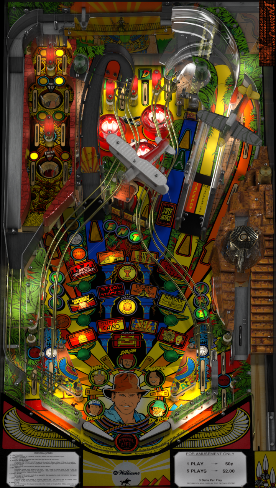

# Indiana Jones The Pinball Adventure (Williams 1993)

Author(s): [bigus1](https://www.vpforums.org/index.php?showuser=107629)  
Version: 2.1
Download: [VP Forum](https://www.vpforums.org/index.php?app=downloads&showfile=14795)

DirectB2S
Author(s): [hauntfreaks](https://vpuniverse.com/profile/5216-hauntfreaks/)  
Version: 1.0.0
Download: [VP Universe](https://vpuniverse.com/files/file/21269-indiana-jones-pinball-adventure-williams-1993-alt-b2s/)

ROM:
Author(s): [destruk](https://www.vpforums.org/index.php?showuser=5)
Version: (Williams L-7)
Download:  [VP Forums](https://www.vpforums.org/index.php?app=downloads&showfile=1185)

Tested by:
[TechZombie]

## Status 

Minimum VPX Standalone build: 10.8.0-1983-b84441e
| Playfield | Controls | Backglass | DMD | ROM Required | FPS | 
|-----------|----------|-----------|-----|--------------|-----|
| :white_check_mark: | :white_check_mark: | :white_check_mark: | :white_check_mark: | :white_check_mark: | 41 |

## Instructions

- Copy the contents of this repo folder to your USB drive
- Add your personalized launcher.elf and rename it to vpx-indianajonestpa.elf
- Download the table and directb2s versions listed above and copy them into vpx-indianajonestpa
- Rom file (ij_l7.zip) stays in zip folder, place zip file in vpx-indianajonestpa/pinmame/roms
- Make sure (.vpx) (.direct2b2s) and (.ini) are all named the same. 
- "Snakes. Why'd it have to be snakes?" -- Indiana Jones
