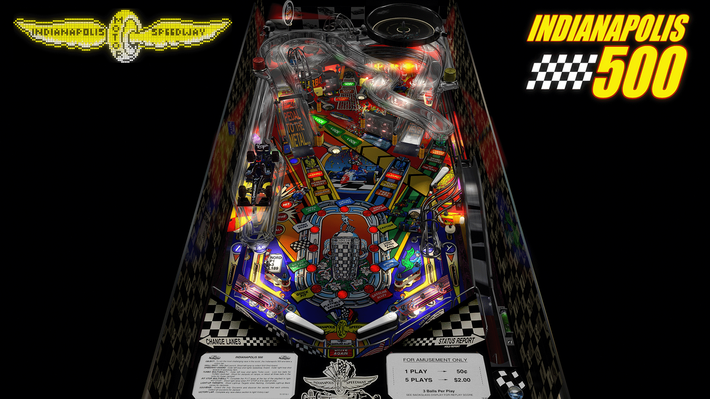

# Indianapolis 500 (Bally 1995)

Authors: [tastywasps](https://vpuniverse.com/profile/44724-tastywasps/)  
Version: 1.36  
Download: [VPUniverse](https://vpuniverse.com/files/file/14539-indianapolis-500-bally-1995/)

DirectB2S

Authors: [Wildman](https://vpuniverse.com/profile/5-wildman/)  
Version: 3.0  
Download: [VP Universe](https://vpuniverse.com/files/file/3737-indianapolis-500-bally-1995/)

ROM

Download: [vpforums](https://www.vpforums.org/index.php?app=downloads&showfile=1266)  
ROM Name and version: i500_11r.zip

## Status 

Minimum VPX Standalone build: 10.8.0-1989-a764013
| Playfield | Controls | Backglass | DMD | ROM Required | FPS | 
|-----------|----------|-----------|-----|--------------|-----|
| :white_check_mark: | :white_check_mark: | :white_check_mark: | :white_check_mark: | :white_check_mark: | 48 |

## Instructions

- "Enjoy a glass of milk after taking the checkered flag!"
