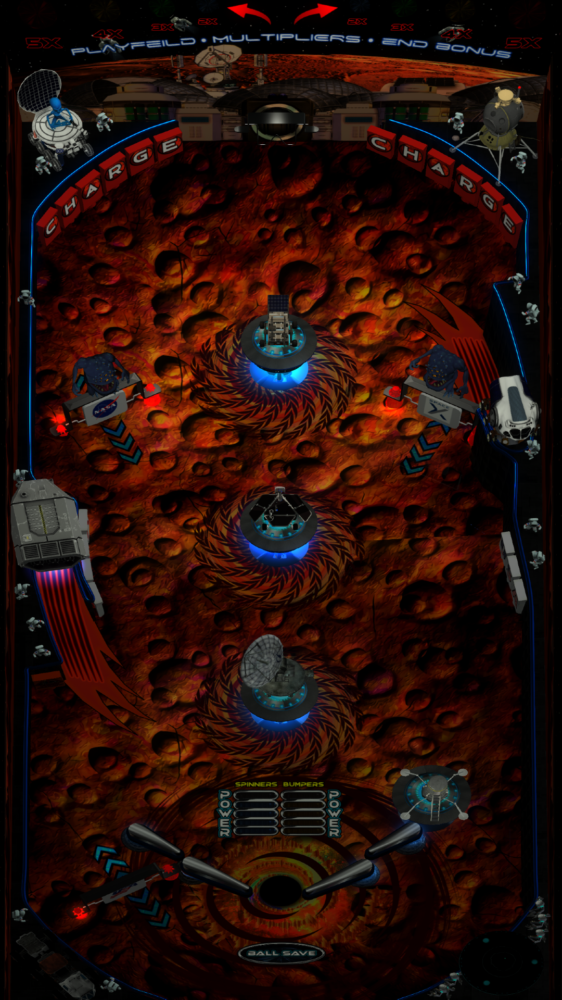

# Inhabiting Mars (Original 2023)

Author: [Joe Picasso](https://vpuniverse.com/profile/15285-joepicasso/)  
Version: Inhabiting Mars (Original 2023)  
Download: [VP Universe](https://vpuniverse.com/files/file/13250-inhabiting-mars/)

DirectB2S:  
Included with table download

ROM:  
Not Required

Tested by:  
[Bla1ze and Silentkat]

***** This table will not have a nudge feature as the nudge buttons are to stand up the flippers - pressing the nudge buttons (left or right) = stand up flippers - pressing flipper buttons = send them back (it will make sense once you play)*****

## Status 

Minimum VPX Standalone build: 10.8.0-1983-b84441e

| Playfield | Controls | Backglass | DMD | ROM Required | FPS | 
|-----------|----------|-----------|-----|--------------|-----|
| :white_check_mark: | :white_check_mark: | :white_check_mark: | :white_check_mark: | :x: | 43 |

## Instructions

- Install this table through the Table Manager, using the `Add Table` > `Manual` page
- If you need help, more infomation found on the wiki: [TM - Add Table - Manual](https://github.com/LegendsUnchained/vpx-standalone-alp4k/wiki/%5B04%5D-%F0%9F%A7%A1-TM-%E2%80%90-Other-Features#add-table---manual)
- If the table requires any additional files/steps, click `GO TO TABLE` after adding, and the TM will open to the relevant table folder.
- Download folder called Inhabiting Mars, unzip,  and copy the vpx from the table folder (Inhabiting Mars RC 4) and backglass from the Backglasses folder (Inhabiting MARS (Original 2023) full dmd) into external/vpx-inhabitinmars
- This table is very unique and works in a very odd way. If you never played orbiter 1 then you might get overwhelmed by its oddity.
- Its uniqueness lies in the special gravity where the ball pushes and pulls away from pop bumpers and even goes all the way around the flippers.

