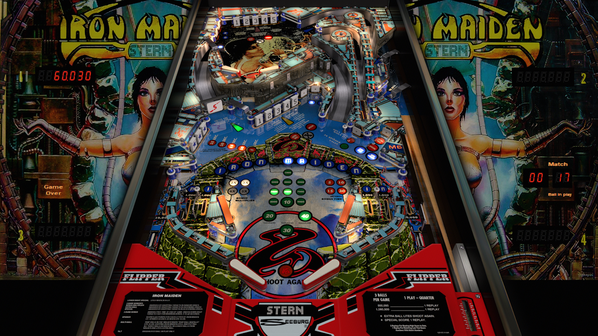

# Iron Maiden (Stern 1981)

Authors: [JPSalas](https://www.vpforums.org/index.php?showuser=277)  
Version: 5.5.0  
Download: [VPforums](https://www.vpforums.org/index.php?app=downloads&showfile=14337#)

DirectB2S

Authors: [Wildman](https://vpuniverse.com/profile/5-wildman/)  
Version: 3.0  
Download: [VPUniverse](https://vpuniverse.com/files/file/2455-iron-maiden-stern-1981/)

ROM

Download: [vpforums](https://www.vpforums.org/index.php?app=downloads&showfile=169)  
ROM Name and version: ironmaid.zip

Tested By: kaoticBPR

## Status 

Minimum VPX Standalone build: 10.8.0-1989-a764013

| Playfield | Controls | Backglass | DMD | ROM Required | FPS | 
|-----------|----------|-----------|-----|--------------|-----|
| :white_check_mark: | :white_check_mark: | :white_check_mark: | :x: | :white_check_mark: | 60 |

## Instructions

- Copy the contents of this repo folder to your USB drive
- Add your personalized launcher.elf and rename it to vpx-ironmaiden.elf
- Download the table and directb2s versions listed above, extract (if necessary) and copy them to external/vpx-ironmaiden
- Make sure the (.vpx), (.directb2s), and (.ini) files are all named the "exact" same
- Place ironmaid.zip ROM in the external/vpx-ironmaiden/pinmame/roms folder. *Do Not unzip!*
- "Survive the Iron Maiden"

