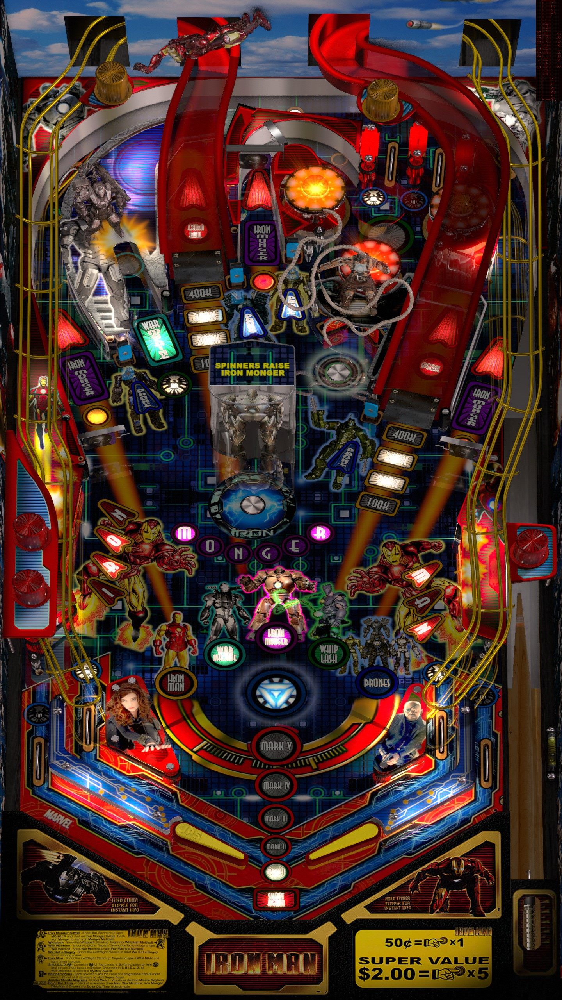

# Iron Man 2, JP's (Original 2018)

Authors: [JPSalas](https://www.vpforums.org/index.php?showuser=277)  
Version: 4.3.0  
Download: [VPForums](https://www.vpforums.org/index.php?app=downloads&showfile=13613)

DirectB2S

Authors: [haggi](https://www.vpforums.org/index.php?showuser=1220)  
Download: [VPForums](https://www.vpforums.org/index.php?app=downloads&showfile=15731)

ROM

ROM Name: IM21860V.BIN  
Download: [Stern](https://sternpinball.com/?post_type=game_code&s=iron+man)  

SHA1: 11787B8C73883E417B92791FA2AB45416EE718EF  
MD5:  FB971A641EFB89B0D131FDD3BFE3579D 

Tested by: Bruno15477 and evilwraith

## Status 

Minimum VPX Standalone build: 10.8.0-1989-a764013

| Playfield | Controls | Backglass | DMD | ROM Required | FPS | 
|-----------|----------|-----------|-----|--------------|-----|
| :white_check_mark: | :white_check_mark: | :white_check_mark: | :white_check_mark: | :white_check_mark: | 60 |

## Instructions

- Install this table through the Table Manager, using the `Add Table` > `Manual` page
- If you need help, more infomation found on the wiki: [TM - Add Table - Manual](https://github.com/LegendsUnchained/vpx-standalone-alp4k/wiki/%5B04%5D-%F0%9F%A7%A1-TM-%E2%80%90-Other-Features#add-table---manual)
- If the table requires any additional files/steps, click `GO TO TABLE` after adding, and the TM will open to the relevant table folder.
- Use the Iron Man Vault Edition 1.86 Game Code link to download the ROM
- Zip IM21860V.BIN, name the zip file im_186ve.zip

