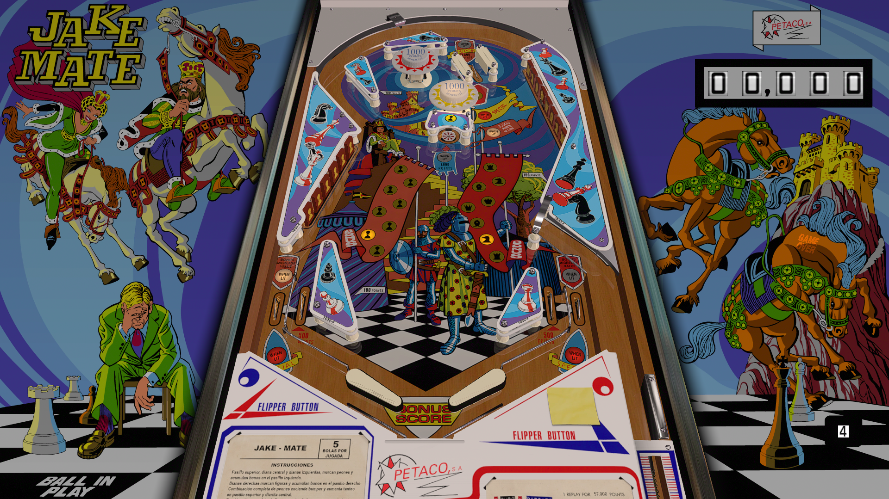

# Jake Mate, JPSalas DT-FS-VR-MR Ext2k Conversion (Petaco - 1974)

Authors: [ext2k](https://vpuniverse.com/profile/55948-ext2k/)  
Version: 1.00  
Download: [VP Forums](https://vpuniverse.com/files/file/22035-jake-mate-petaco-1974-jpsalas-dt-fs-vr-mr-ext2k-conversion/)

DirectB2S

Authors: [ext2k](https://vpuniverse.com/profile/55948-ext2k/)  
Version: 1.00  
Download: [VP Forums](https://vpuniverse.com/files/file/22035-jake-mate-petaco-1974-jpsalas-dt-fs-vr-mr-ext2k-conversion/)

## Status 

Minimum VPX Standalone build: 10.8.0-1989-a764013

| Playfield | Controls | Backglass | DMD | ROM Required | FPS | 
|-----------|----------|-----------|-----|--------------|-----|
| :white_check_mark: | :white_check_mark: | :white_check_mark: | :x: | :x: | 60 |

## Instructions

- Install this table through the Table Manager, using the `Add Table` > `Manual` page
- If you need help, more infomation found on the wiki: [TM - Add Table - Manual](https://github.com/LegendsUnchained/vpx-standalone-alp4k/wiki/%5B04%5D-%F0%9F%A7%A1-TM-%E2%80%90-Other-Features#add-table---manual)
- If the table requires any additional files/steps, click `GO TO TABLE` after adding, and the TM will open to the relevant table folder.

