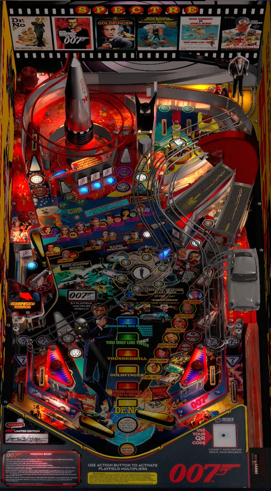

# James Bond 007 (Stern 2022)

TESTED: Mar3nBu

Authors: [timblo](https://vpuniverse.com/profile/22603-timblo/)  
Version: 1.1.0  
Download: [VPUniverse](https://vpuniverse.com/files/file/12132-james-bond-60-th-timblo-grafic-mod-v-11/)

DirectB2S

Authors: [goodtwist](https://vpuniverse.com/profile/49948-goodtwist/)  
Version:  1.0.0  
Download: [VPUniverse](https://vpuniverse.com/files/file/11948-bond-60th-you-only-live-twice-backglass/)

## Status 

Minimum VPX Standalone build: 10.8.0-1989-a764013

| Playfield | Controls | Backglass | DMD | ROM Required | FPS | 
|-----------|----------|-----------|-----|--------------|-----|
| :white_check_mark: | :white_check_mark: | :white_check_mark: | :white_check_mark: | :x: | 60 |

## Instructions

- Copy the contents of this repo folder to your USB drive
- Add your personalized launcher.elf and rename it to vpx-jamesbond007.elf
- Download the table and directb2s versions listed above, extract (if necessary) and copy them to external/vpx-jamesbond007
- Make sure (.vpx), (.directb2s), and (.ini) files are all named the same
- Go enjoy some shaken, not stirred, Martinis! 

