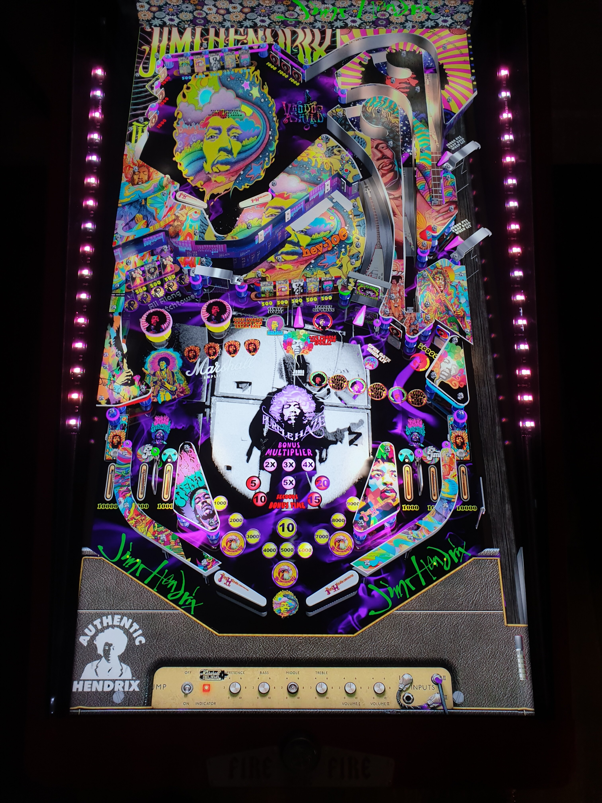

# Jimi Hendrix (Original 2021)

Authors: [balutito](https://vpuniverse.com/profile/36070-balutito/)  
Version: 1.2  
Download: [VPUniverse](https://vpuniverse.com/files/file/7736-jimi-hendrix-v1/)

DirectB2S

Included in table zip

Music

Included in table zip

ROM

ROM Name: ironmaid.zip  
Included in table zip

SHA1: AFDBE26D3830D41850C701F0983842E2A6144662  
MD5:  712C9FF61BE0834F9E154AFD67660A06 

Tested by: evilwraith

## Status 

Minimum VPX Standalone build: 10.8.0-1989-a764013

| Playfield | Controls | Backglass | DMD | ROM Required | FPS | 
|-----------|----------|-----------|-----|--------------|-----|
| :white_check_mark: | :white_check_mark: | :white_check_mark: | :x: | :white_check_mark: | 60 |

## Instructions

- Install this table through the Table Manager, using the `Add Table` > `Manual` page
- If you need help, more infomation found on the wiki: [TM - Add Table - Manual](https://github.com/LegendsUnchained/vpx-standalone-alp4k/wiki/%5B04%5D-%F0%9F%A7%A1-TM-%E2%80%90-Other-Features#add-table---manual)
- If the table requires any additional files/steps, click `GO TO TABLE` after adding, and the TM will open to the relevant table folder.
- Download the music folder listed above, extract (if necessary) and copy to external/vpx-jimihendrix

