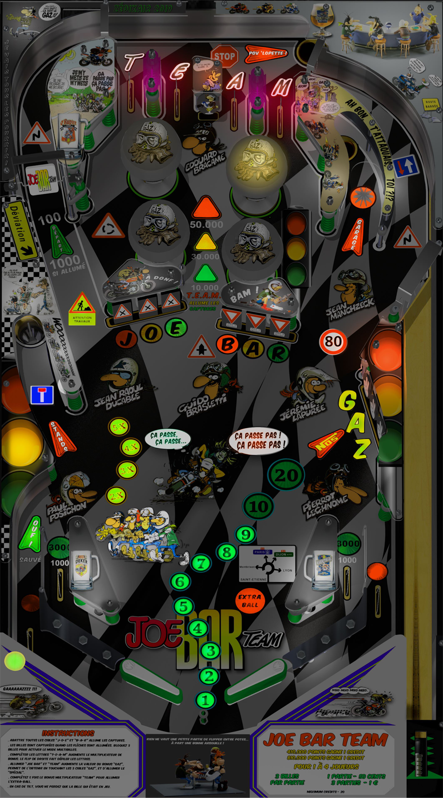

# Joe Bar Team (ZXR 2019)

PFimage.png.374a51e4fb0b7db72b5d31e456c7bb08.png)

Authors: Zedixair  
Version: 1.0.0  
Download: [VPUniverse](https://vpuniverse.com/files/file/14127-joe-bar-team-mod-by-zxr-complete-package-tablebackglassmusicmedias/)

DirectB2S included with table pack

ROM included with table pack  
ROM Name: frpwr_b7.zip  

Tested by: TechZombie

## Status 

Minimum VPX Standalone build: 10.8.0-1989-a764013

| Playfield | Controls | Backglass | DMD | ROM Required | FPS | 
|-----------|----------|-----------|-----|--------------|-----|
| :white_check_mark: | :white_check_mark: | :white_check_mark: | :x: | :white_check_mark: | 50 |

## Instructions

- Install this table through the Table Manager, using the `Add Table` > `Manual` page
- If you need help, more information found on the wiki: [TM - Add Table - Manual](https://github.com/LegendsUnchained/vpx-standalone-alp4k/wiki/%5B04%5D-%F0%9F%A7%A1-TM-%E2%80%90-Other-Features#add-table---manual)
- If the table requires any additional files/steps, click `GO TO TABLE` after adding, and the TM will open to the relevant table folder.
- Move/Copy Music Folder ---> external/vpx-joebarteam
- "Ca Passe Pas!" - Jeremie Lapuree

