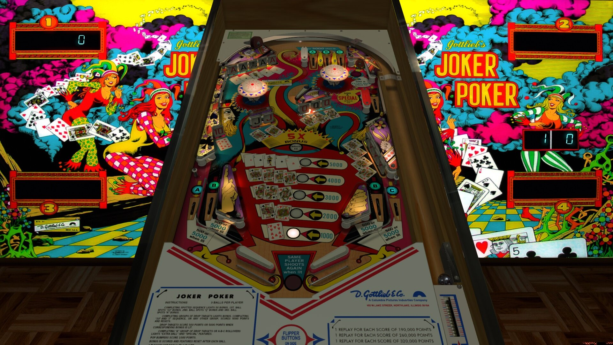

# Joker Poker (Gottlieb 1978)

Author(s): [Goldchicco](https://vpuniverse.com/profile/23579-goldchicco/)  
Version:  Joker Poker (Gottlieb 1978) 1.1  
Download:  [VP Universe](https://vpuniverse.com/files/file/7507-joker-poker-gottlieb-1978/)

DirectB2S

Authors: [Wildman](https://vpuniverse.com/profile/5-wildman/)  
Version: Joker Poker (Gottlieb 1978)  
Download: [VP Universe](https://vpuniverse.com/files/file/3152-joker-poker-gottlieb-1978/)

ROM:  jokrpokr

Authors: [MoxAssault](https://pinballnirvana.com/forums/members/moxassault.47593/)  
Version: jokrpokr.zip  
Download: [Pinball Nirvana](https://pinballnirvana.com/forums/resources/jokrpokr-zip.8427/)

Tested by:  
[CoffeeAtJoes]

## Status 

Minimum VPX Standalone build: 10.8.0-1983-b84441e

| Playfield | Controls | Backglass | DMD | ROM Required | FPS | 
|-----------|----------|-----------|-----|--------------|-----|
| :white_check_mark: | :white_check_mark: | :white_check_mark: | :x: | :white_check_mark: | 50 |

## Notes

- DMD on backglass
- Thank you Mox, for help with the ROM!

## Instructions

- Install this table through the Table Manager, using the `Add Table` > `Manual` page
- If you need help, more information found on the wiki: [TM - Add Table - Manual](https://github.com/LegendsUnchained/vpx-standalone-alp4k/wiki/%5B04%5D-%F0%9F%A7%A1-TM-%E2%80%90-Other-Features#add-table---manual)
- If the table requires any additional files/steps, click `GO TO TABLE` after adding, and the TM will open to the relevant table folder.
- "A BRIGHT NEW SNAPPY playing card game from the EXPERTS of PLAYER APPEAL." ~ D. Gottlieb & Co.

