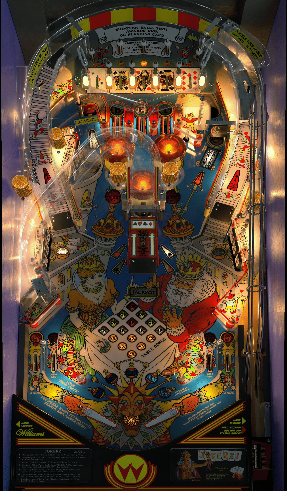

# Jokerz! (Williams 1988)

Author: [VPinWorkshop](https://vpuniverse.com/profile/40692-vpinworkshop/) 

Tested by: Bla1ze 

Version: 1.3.1 

Download: [VP Universe](https://vpuniverse.com/files/file/9971-jokerz-williams-1988-vpw/)

DirectB2S

Author: [Hauntfreaks](https://vpuniverse.com/profile/5216-hauntfreaks/)

Version: 1.0.0

Download: [VP Universe](https://vpuniverse.com/files/file/14774-jokerz-williams-1988-b2s-with-full-dmd/)

ROM

Download: [VP Forums](https://www.vpforums.org/index.php?app=downloads&showfile=917)

SHA: 6ac485c8344472e2ef007773dc38ee6510f47553 

MD5: d939913d6932bdf417851cd4dd4663ee

## Status 

Minimum VPX Standalone build: 10.8.0-1983-a764013
| Playfield | Controls | Backglass | DMD | ROM Required | FPS | 
|-----------|----------|-----------|-----|--------------|-----|
| :white_check_mark: | :white_check_mark: | :white_check_mark: | :white_check_mark: | :white_check_mark: | 40 |

## Instructions

- Install this table through the Table Manager, using the `Add Table` > `Manual` page
- If you need help, more information found on the wiki: [TM - Add Table - Manual](https://github.com/LegendsUnchained/vpx-standalone-alp4k/wiki/%5B04%5D-%F0%9F%A7%A1-TM-%E2%80%90-Other-Features#add-table---manual)
- If the table requires any additional files/steps, click `GO TO TABLE` after adding, and the TM will open to the relevant table folder.
- Note: On initial load, you may have to restart the table once or twice. It will be fine after that.
- Jokerz! IZ WILD! 🃏

