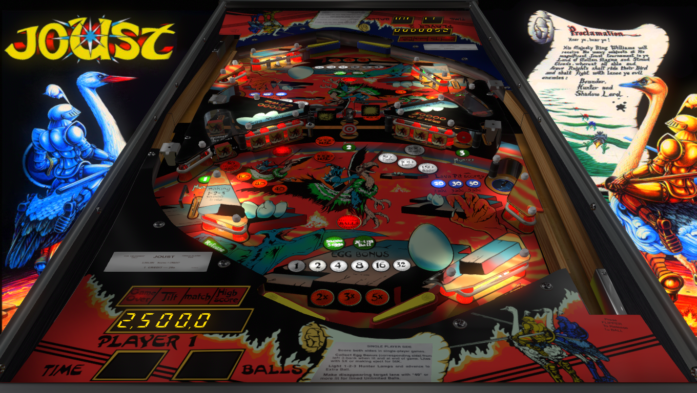

# Joust (Williams 1983)

Authors: [xenonph](https://pinballnirvana.com/forums/members/xenonph.21719/)  
Version: v1.0  
Download: [pinball nirvana](https://pinballnirvana.com/forums/resources/joust-williams-1983-mod.8315/)

DirectB2S

Included in table download

ROM

Download: [Pinball Nirvana](https://pinballnirvana.com/forums/resources/jst_l2.1999/)  
ROM Name and version: jst_l2.zip

## Status 

Minimum VPX Standalone build: 10.8.0-1989-a764013

| Playfield | Controls | Backglass | DMD | ROM Required | FPS | 
|-----------|----------|-----------|-----|--------------|-----|
| :white_check_mark: | :white_check_mark: | :white_check_mark: | :white_check_mark: | :white_check_mark: | 60 |

## Instructions

- Hold Left Flipper to access game options to change from 1p vs 1p, 1p vs com, 1p vs 2p(not recommended)
- "Ride your Ostrich into battle"

