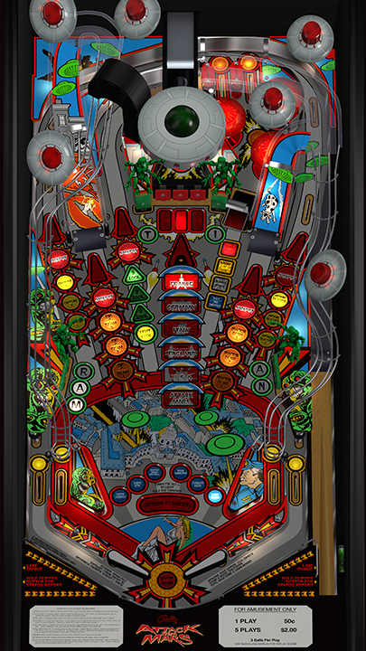

# Attack From Mars (Bally 1995) vpx Graphics Remaster

---

## Files
| File Type |                                                 Link                                                  |   Version    |                                                          Author                                                          |
|:---------:|:-----------------------------------------------------------------------------------------------------:|:------------:|:------------------------------------------------------------------------------------------------------------------------:|
| VPX |             [VP Forums](https://www.vpforums.org/index.php?app=downloads&showfile=15086)              |    2.0.1     | [brad1x](https://www.vpforums.org/index.php?showuser=67440), [JP Salas](https://www.vpforums.org/index.php?showuser=277) |
| B2S | [VP Universe](https://vpuniverse.com/files/file/12165-attack-from-mars-bally-1995-b2s-with-full-dmd/) |     1.0      |                             [hauntfreaks](https://vpuniverse.com/profile/5216-hauntfreaks/)                              |
| DMD |      [VP Universe](https://vpuniverse.com/files/file/19896-attack-from-mars-serum-colorization/)      |     2.0      |                                  [KRAKEN](https://vpuniverse.com/profile/35517-kraken/)                                  |
| ROM |              [VP Forums](https://www.vpforums.org/index.php?app=downloads&showfile=1340)              | afm_113b.zip |                                 [destruk](https://www.vpforums.org/index.php?showuser=5)                                 |

**Tested by:** [kingargyle]

---

## Status 
**Minimum VPX Standalone build:** 10.8.0-1989-a764013
| Playfield | Controls | Backglass | DMD | ROM Required | FPS | 
|-----------|----------|-----------|-----|--------------|-----|
| :white_check_mark: | :white_check_mark: | :white_check_mark: | :white_check_mark: | :white_check_mark: | 58 |

---

## Instructions

- Install this table through the Table Manager, using the `Add Table` > `Manual` page
- If you need help, more information found on the wiki: [TM - Add Table - Manual](https://github.com/LegendsUnchained/vpx-standalone-alp4k/wiki/%5B04%5D-%F0%9F%A7%A1-TM-%E2%80%90-Other-Features#add-table---manual)
- If the table requires any additional files/steps, click `GO TO TABLE` after adding, and the TM will open to the relevant table folder.

