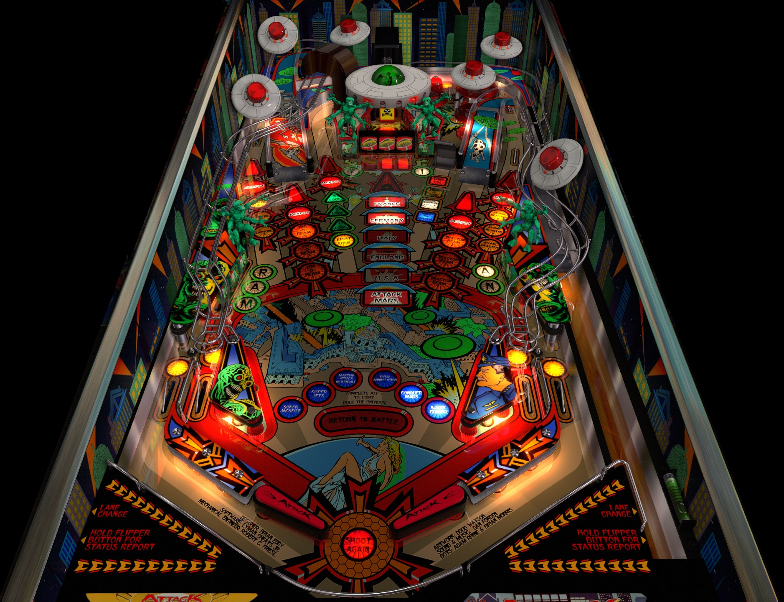

# Attack from Mars LE, JP's (Chicago Gaming Company 2017)

 

## *️⃣  Table Statistics

| Backglass | DMD | ROM Required | Has Puppack | FPS |
|-----------|-----|-----|-----|-----|
| ✅ | ✅ | ✅ | ❌ | 60 |

 

**VPXS 4KP Testers:**
  - BrianCK
  - Ominous Osie 🌸

 

---

 

## ❇️ Available in the Wizard! 🪄✨

 

This table is available through the Table Manager Wizard, which makes installation quick and easy!

### How to install:

1.  Open the **Table Manager**
2.  Click the **Add Table** button
3.  Select the **Wizard** tab
4.  Find and select this table from the dropdown menu: **`Attack from Mars LE, JP's (Bally 1995)`**
5.  Follow the on-screen instructions to download and upload the required files
6. *"Blow the saucer out of the sky!!"*

 

Using the Wizard ensures you get the latest table version, have all required files (ROM, backglass, etc.), and have all the VPXS 4KP team's table tweaks and improvements!

 

__*We hope you enjoy!!*__

*The VPXS 4KP Wizard team:*
<pre>
- n-i-x            - Mox              - Lloydbraun
- Boris Undead     - 'Coffee' Joe     - Ominous Osie 🌸
- Bla1ze           - evilwraith       - Silentkat        
- mrandromeda      - SScorpio         - pointdablame
</pre>

 
 
 
 
 
