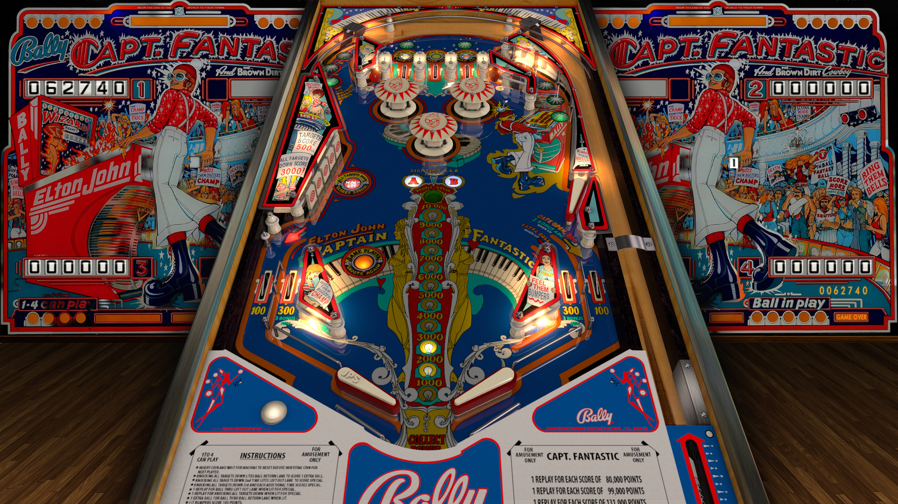

# Capt. Fantastic and The Brown Dirt Cowboy, JPs (Bally 1976)

---

## Files
| File Type | Link | Version | Author | 
|-----------|--------|----------|--------------|
| **VPX** | [VP Forums](https://www.vpforums.org/index.php?app=downloads&showfile=15248) | 5.5.0 | [JP Salas](https://www.vpforums.org/index.php?showuser=277) |
| **B2S** | [VP Universe](https://vpuniverse.com/files/file/11587-capt-fantastic-and-the-brown-dirt-cowboy-bally-1976-b2s/) | 1.0.1 | [Hauntfreaks](https://vpuniverse.com/profile/5216-hauntfreaks/) |

---

## Status 
Minimum VPX Standalone build: 10.8.0-1989-a764013

| Playfield | Controls | Backglass | DMD | ROM Required | FPS | 
|-----------|----------|-----------|-----|--------------|-----|
| :white_check_mark: | :white_check_mark: | :white_check_mark: | :x: | :x: | 60 |

---

## Instructions

- Install this table through the Table Manager, using the `Add Table` > `Manual` page
- If you need help, more information found on the wiki: [TM - Add Table - Manual](https://github.com/LegendsUnchained/vpx-standalone-alp4k/wiki/%5B04%5D-%F0%9F%A7%A1-TM-%E2%80%90-Other-Features#add-table---manual)
- If the table requires any additional files/steps, click `GO TO TABLE` after adding, and the TM will open to the relevant table folder.
- Special version by JP Salas with single left flipper. Ring them bells!
---

