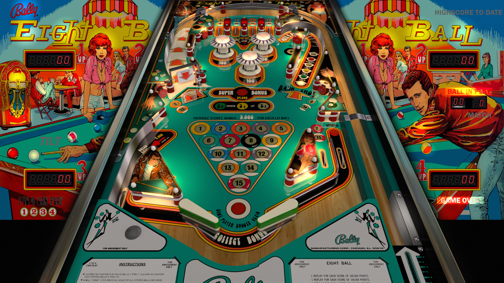

# Eight Ball (Bally 1977)

---

## Files
| File Type | Link | Version | Author | 
|-----------|--------|----------|--------------|
| **VPX** | [VP Forums](https://www.vpforums.org/index.php?s=721eb941c32e5b5bc5175ec43e6529fa&app=downloads&showfile=13562#) | 5.5.0 | [JP Salas](https://www.vpforums.org/index.php?showuser=277) |
| **B2S** | [VP Universe](https://vpuniverse.com/files/file/7767-eight-ball-bally-1977/) | 1.0.0 | [Wildman](https://vpuniverse.com/profile/5-wildman/) |
| **ROM** | [VP Forums](https://www.vpforums.org/index.php?app=downloads&showfile=708) | eightbll | [destruk](https://www.vpforums.org/index.php?showuser=5) |

---

## Status 
Minimum VPX Standalone build: 10.8.0-1989-a764013
| Playfield | Controls | Backglass | DMD | ROM Required | FPS | 
|-----------|----------|-----------|-----|--------------|-----|
| :white_check_mark: | :white_check_mark: | :white_check_mark: | :x: | :white_check_mark: | 60 |

---

## Instructions

---

**MD5**: bea5925ca8e1fb4ebbeb1dfb89779eec

**Tested by:** Shaver
