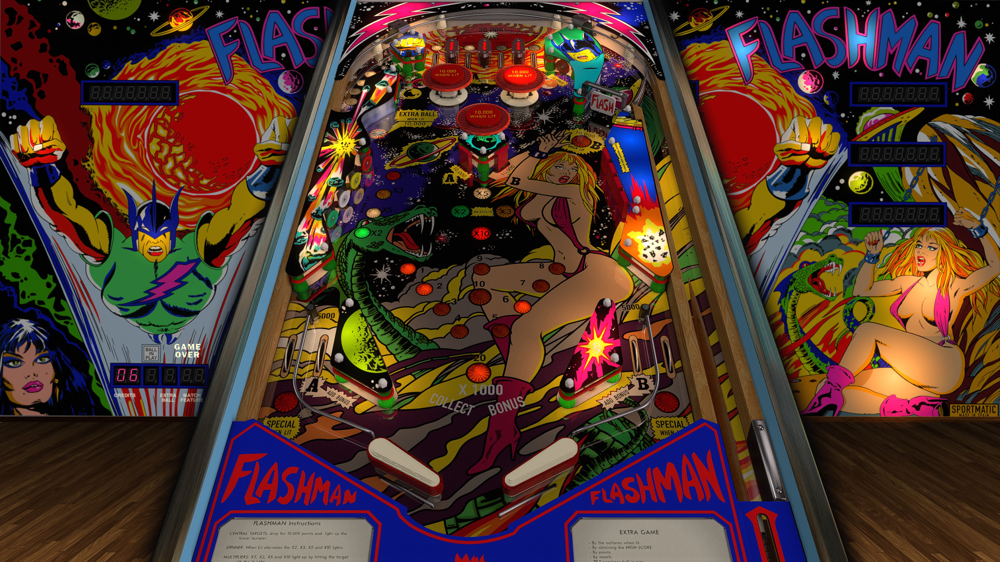

# Flashman (Sportmatic 1984)

---

## Files
| File Type | Link | Version | Author | 
|-----------|--------|----------|--------------|
| **VPX** | [VP Forums](https://www.vpforums.org/index.php?app=downloads&showfile=16517) | 5.5.0 | [JP Salas](https://www.vpforums.org/index.php?showuser=277) |
| **B2S** | [VP Universe](https://vpuniverse.com/files/file/9312-flashman-sportmatic-1984/) | 1.1.0 | [Shannon](https://vpuniverse.com/profile/7353-shannon/) |
| **ROM** | [VP Forums](https://vpuniverse.com/files/file/5713-flashman/) | flashman | [CarnyPriest](https://vpuniverse.com/profile/1146-carnypriest/) |

---

## Status 
Minimum VPX Standalone build: 10.8.0-1989-a764013
| Playfield | Controls | Backglass | DMD | ROM Required | FPS | 
|-----------|----------|-----------|-----|--------------|-----|
| :white_check_mark: | :white_check_mark: | :white_check_mark: | :x: | :white_check_mark: | 60 |

---

## Instructions

- Copy the contents of this repo folder to your USB drive
- Add your personalized launcher.elf and rename it to `vpx-jpflashman.elf`
- Download the table and directb2s versions listed above, extract (if necessary) and copy them into `vpx-jpflashman` folder
- Place ROM zip file into `vpx-jpflashman/pinmame/roms` folder. DO NOT UNZIP!
- Make sure `(.vpx)` `(.direct2b2s)` and `(.ini)` are all named the same.

---

*MD5**: 920f660b372c87dae5dd634db0371818

**Tested by:** Shaver
