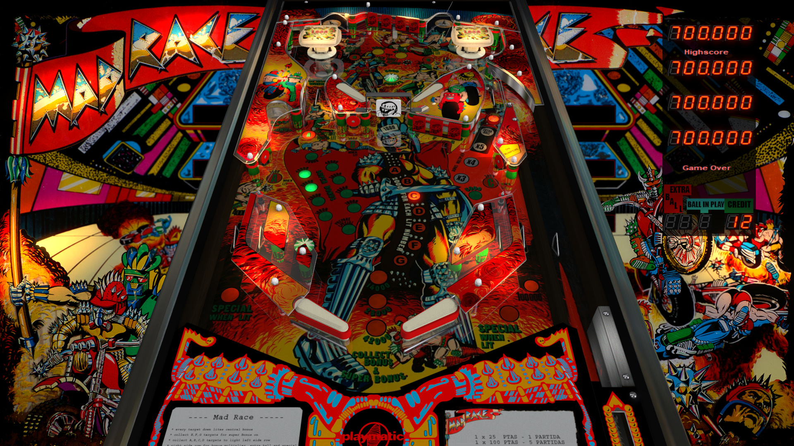

# Mad Race (Playmatic 1985)

---

## Files
| File Type | Link | Version | Author | 
|-----------|--------|----------|--------------|
| **VPX** | [VP Forums](https://www.vpforums.org/index.php?app=downloads&showfile=14036) | 5.5.0 | [jpsalas](https://www.vpforums.org/index.php?showuser=277) |
| **B2S** | [VP Forums](https://vpuniverse.com/files/file/20533-mad-race-playmatic-1985-jpsalas-v4-vr-mr-ext2k/) | 1.0.0 | [Ext2k](https://vpuniverse.com/profile/55948-ext2k/) |
| **ROM** | [VP Forums](https://www.vpforums.org/index.php?app=downloads&showfile=549) | madrace | [destruk](https://www.vpforums.org/index.php?showuser=5) |

---

## Status 
Minimum VPX Standalone build: 10.8.0-1989-a764013

| Playfield | Controls | Backglass | DMD | ROM Required | FPS | 
|-----------|----------|-----------|-----|--------------|-----|
| :white_check_mark: | :white_check_mark: | :white_check_mark: | :x: | :white_check_mark: | 60 |

---

## Instructions

- Copy the contents of this repo folder to your USB drive
- Add your personalized launcher.elf and rename it to `vpx-jpmadrace.elf`
- Download the table and directb2s versions listed above, extract (if necessary) and copy them into `vpx-jpmadrace` folder. **NOTE:** The zip package for the .directb2s also includes a VR .vpx file. Ignore this .vpx file. Just use the .directb2s file from this package.
- Place ROM zip file into `vpx-jpmadrace/pinmame/roms` folder. DO NOT UNZIP!
- Make sure `(.vpx)`, `(.directb2s)` and `(.ini)` are all named the same.

---

**MD5:** a0cc2321aeebf76ef85e414f5ac20faf

**Tested by:** Shaver
