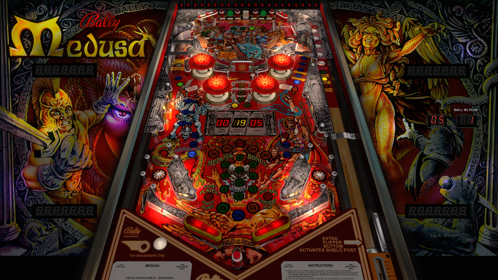

# Medusa (Bally 1981)

---

## Files
| File Type | Link | Version | Author | 
|-----------|--------|----------|--------------|
| **VPX** | [VP Forums](https://www.vpforums.org/index.php?app=downloads&showfile=12926) | 5.5.0 | [JP Salas](https://www.vpforums.org/index.php?showuser=277) |
| **B2S** | [VP Universe](https://vpuniverse.com/files/file/12171-medusa-bally-1981-prototype-authentic-lighting/) | 2.5 | [hauntfreaks](https://vpuniverse.com/profile/5216-hauntfreaks/) |
| **ROM** | [VP Forums](https://www.vpforums.org/index.php?app=downloads&showfile=659) | medusa | [destruk](https://www.vpforums.org/index.php?showuser=5) |

---

## Status 
Minimum VPX Standalone build: 10.8.0-1989-a764013
| Playfield | Controls | Backglass | DMD | ROM Required | FPS | 
|-----------|----------|-----------|-----|--------------|-----|
| :white_check_mark: | :white_check_mark: | :white_check_mark: | :x: | :white_check_mark: | 58 |

---

## Instructions

---

**MD5**: 19ec698d1643f8676a7cabc12312d268

**Tested by:** Shaver
