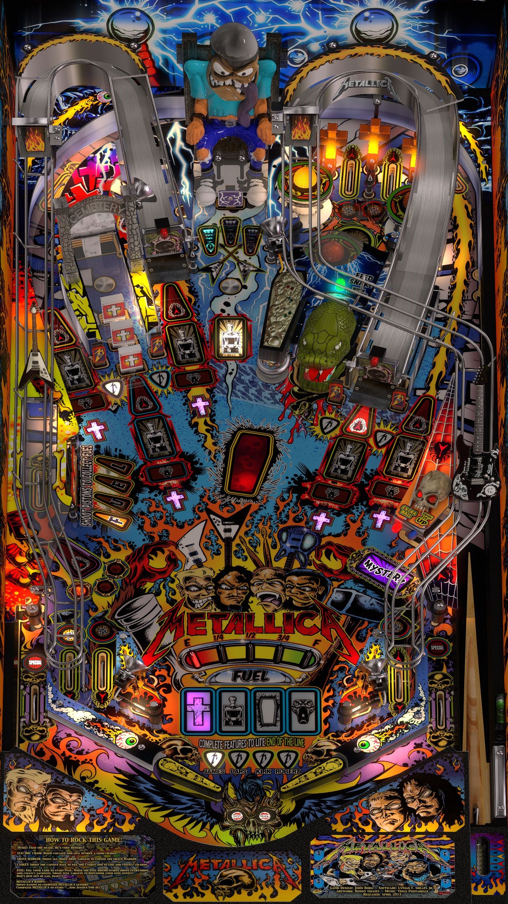

# Metallica Pro, JPs (Stern 2013)

Authors: [jpsalas](https://www.vpforums.org/index.php?s=c4190c252e4b0afe20488a58dfe99e31&showuser=277)  
Version: 5.5.1
Download: [VP Forums](https://www.vpforums.org/index.php?app=downloads&showfile=18612)

DirectB2S

Authors: [hauntfreaks](https://vpuniverse.com/profile/5216-hauntfreaks/)  
Version: 3.0  
Download: [VP Universe](https://vpuniverse.com/files/file/10947-metallica-premium-monsters-stern-2013-b2s-with-full-dmd/)  
Note: Choose "Metallica Pro (Stern 2013).zip"

ROM

ROM Name: MTL180.BIN  
Download: [Stern](https://sternpinball.com/?post_type=game_code&s=metallica)

## Status 

Minimum VPX Standalone build: 10.8.0-1989-a764013

| Playfield | Controls | Backglass | DMD | ROM Required | FPS | 
|-----------|----------|-----------|-----|--------------|-----|
| :white_check_mark: | :white_check_mark: | :white_check_mark: | :white_check_mark: | :white_check_mark: | 60 |

## Instructions

- Copy the contents of this repo folder to your USB drive
- Add your personalized launcher.elf and rename it to vpx-jpmetallica.elf
- Download the table and directb2s versions listed above, extract (if necessary) and copy them to external/vpx-jpmetallica
- Make sure (.vpx), (.directb2s), and (.ini) files are all named the same
- Use the Metallica Pro 1.80 Game Code link to download the ROM
- Zip MTL180.BIN, name the zip file mtl_180.zip
- Place ROM zip file into vpx-jpmetallica/pinmame/roms folder. DO NOT UNZIP!
