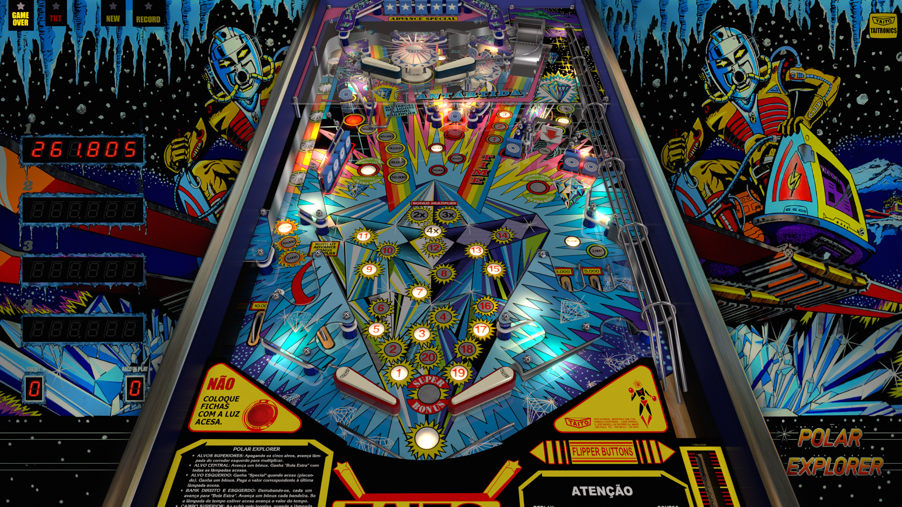

# Polar Explorer (Taito do Brasil 1983)

---

## Files
| File Type | Link | Version | Author | 
|-----------|--------|----------|--------------|
| **VPX** | [VP Forums](https://www.vpforums.org/index.php?app=downloads&showfile=13700) | 5.5.0 | [JP Salas](https://www.vpforums.org/index.php?showuser=277) |
| **B2S** | [VP Forums](https://www.vpforums.org/index.php?app=downloads&showfile=13133) | 1.0b | [STAT](https://www.vpforums.org/index.php?showuser=11253) |
| **ROM** | [VP Forums](https://www.vpforums.org/index.php?app=downloads&showfile=587) | polar | [destruk](https://www.vpforums.org/index.php?showuser=5) |

---

## Status 
Minimum VPX Standalone build: 10.8.0-1989-a764013
| Playfield | Controls | Backglass | DMD | ROM Required | FPS | 
|-----------|----------|-----------|-----|--------------|-----|
| :white_check_mark: | :white_check_mark: | :white_check_mark: | :x: | :white_check_mark: | 60 |

---

## Instructions

---

**MD5**: 718b4d07b1da13d74df1751573b021f6

**Tested by:** Shaver
