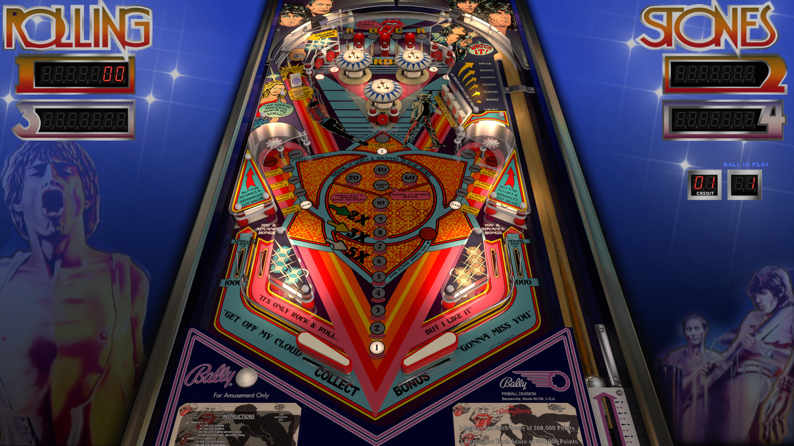

# Rolling Stones (Bally 1980)

---

## Files
| File Type | Link | Version | Author | 
|-----------|--------|----------|--------------|
| **VPX** | [VP Forums](https://www.vpforums.org/index.php?app=downloads&showfile=12914) | 5.5.0 | [JP Salas](https://www.vpforums.org/index.php?showuser=277) |
| **B2S** | [VP Universe](https://vpuniverse.com/files/file/16581-rolling-stones-bally-1980-b2s/) | 1.0.1 | [Hauntfreaks](https://vpuniverse.com/profile/5216-hauntfreaks/) |
| **ROM** | [VP Forums](https://www.vpforums.org/index.php?app=downloads&showfile=681) | rollstob | [destruk](https://www.vpforums.org/index.php?showuser=5) |

---

## Status 
Minimum VPX Standalone build: 10.8.0-1989-a764013
| Playfield | Controls | Backglass | DMD | ROM Required | FPS | 
|-----------|----------|-----------|-----|--------------|-----|
| :white_check_mark: | :white_check_mark: | :white_check_mark: | :x: | :white_check_mark: | 60 |

---

## Instructions

- Copy the contents of this repo folder to your USB drive
- Add your personalized launcher.elf and rename it to `vpx-jprollingstones.elf`
- Download the table and directb2s versions listed above, extract (if necessary) and copy them into `vpx-jprollingstones` folder
- Place ROM zip file into `vpx-jprollingstones/pinmame/roms` folder. DO NOT UNZIP!
- Make sure `(.vpx)` `(.direct2b2s)` `(.vbs)` and `(.ini)` are all named the same.
- It's only rock and roll, but I like it!

---

**MD5**: 9bd19e195b3e33a80de5525419a64eba

**Tested by:** Shaver
