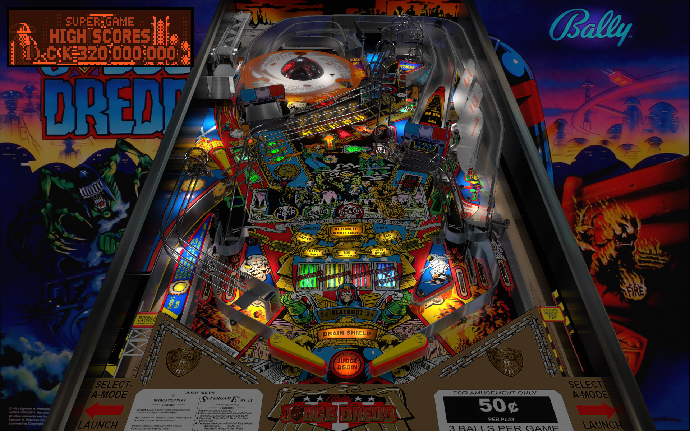

# Judge Dredd (Bally 1993)

Author: [bigus1](https://www.vpforums.org/index.php?showuser=107629) 

Tested by: Bla1ze 

Version: 3.1

Download: [VP Forums](https://www.vpforums.org/index.php?app=downloads&showfile=14597)

DirectB2S

Author: [Wildman](https://vpuniverse.com/profile/5-wildman/)

Verion: 2.0

Download: [VP Universe](https://vpuniverse.com/files/file/2223-judge-dreddbally-1993/)

ROM

Download:  [VP Forums](https://www.vpforums.org/index.php?app=downloads&showfile=1193)

SHA: dfd14727b43c91cb671737d813afe70ef78e8d77

MD5: 9b34563dac437408dfb6753965cb5723

## Status 

Minimum VPX Standalone build: 10.8.0-1983-a764013
| Playfield | Controls | Backglass | DMD | ROM Required | FPS | 
|-----------|----------|-----------|-----|--------------|-----|
| :white_check_mark: | :white_check_mark: | :white_check_mark: | :white_check_mark: | :white_check_mark: | 45 |

## Instructions

- Copy the contents of this repo folder to your USB drive
- Add your personalized launcher.elf and rename it to vpx-judgedredd.elf
- Download the table, ROM and directb2s versions listed above and copy them into this folder
- Make sure (.vpx), (.directb2s), (.ini) and (.vbs) files are all named the same
- Place ROM zip file into vpx-judgedredd/pinmame/roms folder. DO NOT UNZIP!
- "I never broke the law, I AM THE LAW!"
